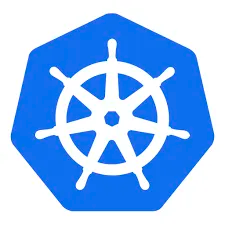
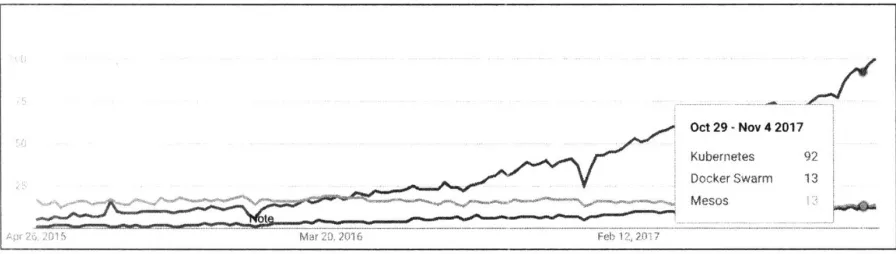
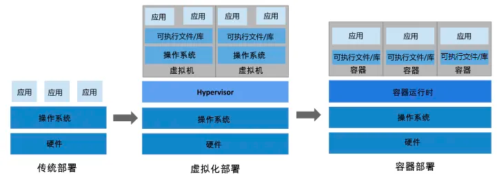
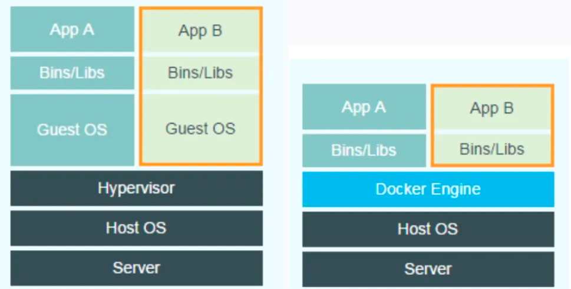

## 前言

在"云原生"、"应用上云"火热的这几年，相信大家或多或少都听说过K8S这个可以称得上是**容器编排领域事实**的存在。

可以看出在2017年之后，K8S热度远超容器编排领域的另外两个工具`Mesos`和`Docker Swarm`，并将它们甩开了几十条街，成为了整个容器编排领域的龙头。

随着现在越来越多的企业把业务系统上云之后，大部分的服务都运行在`Kubernetes`环境中，可以说`Kubernetes`已经成为了云、运维和容器行业最炙手可热的工具，这也是为什么需要学习`Kubernetes`最重要的原因。

目前，AWS、Azure、Google、阿里云、腾讯云等主流公有云提供的是基于`Kubernetes`的容器服务。Rancher、CoreOS、IBM、Mirantis、Oracle、Red Hat、VMWare等无数厂商也在大力研发和推广基于`Kubernetes`的PaaS产品。

目前国内容器服务平台做的比较好的有**腾讯云容器服务TKE**和**阿里云容器服务ACK**，它们都是基于K8S做的二开，有兴趣的读者可以自己了解和尝试使用。

## K8S是什么？

K8S是单词**Kubernetes**的缩写，这个单词在古希腊语中是 **[舵手]** 的意思，之所以简称其为K8S，是因为'K'字母与'S'字母之间隔着八个单词，为了简便称呼，于是有了K8S这个简称。

K8S起初是`Google`内部的一个名为`Borg`的系统，据说`Google`有超过二十亿的容器运行在`Borg`上，在积累了十几年的经验之后，`Google`在2014年重写并开源了该项目，改名为`Kubernetes`。

K8S在基于容器部署的方式上，提供了一个弹性分布式的框架，支持服务发现与负载均衡、存储、自动部署回滚、自动计算与调度、自动扩缩容等等一系列操作，目的是方便开发者不再需要关注服务运行细节，K8S能够自动进行容器与Pod调度、扩缩容、自动重建等等操作，保证服务尽可能健康的运行。

一句话来概括：**K8S解放了开发者的双手，能够最大程度的让部署的服务健康运行，同时能够接入很多第三方工具（如服务监控、数据采集等等），满足开发者的定制化需求。**

## 部署演变之路

### 传统部署时代

在互联网开发早期，开发者会在物理服务器上直接运行应用程序。以一个Go Web程序举例，很典型的一个部署方式是首先在本地编译好对应的二进制文件，之后上传到服务器，然后运行应用。

由于无法限制在物理服务器中运行的应用程序资源使用，因此会导致资源分配问题。例如，如果在同一台物理服务器上运行多个应用程序，则可能会出现一个应用程序占用大部分资源的情况，从而导致其他应用程序的性能下降。

### 虚拟化部署时代

为了解决上述问题，虚拟化技术被引入了。虚拟化技术允许你在单个物理服务器上运行多个虚拟机（VM）。虚拟化能够使应用程序在不同VM之间被彼此隔离，且能提高一定的安全性，因为一个应用程序的信息不能被另一应用程序随意访问。

虚拟化能够更好地利用物理服务器的资源，并且因为可以轻松地添加或者更新应用程序，而因此可以具有更高的扩缩容性，以及降低硬件成本等等的好处。通过虚拟化，可以将一组物力资源呈现为可丢弃的虚拟机集群。每个VM是一台完整的计算机，在虚拟化硬件之上运行所有的组件，包括自身的操作系统`Guest OS`。

### 容器部署时代

容器类似于VM，但是具有更轻松的隔离特性，使得容器之间可以共享操作系统`Host OS`，并且容器不会像VM那样虚拟化硬件，例如打印机等等，只是提供一个服务的运行环境。

通常一台物理机只能运行十几或者数十个VM，但是可以启动成千上万的容器。因此，容器和VM比起来是更加轻量级的，且具有和VM一样的特性：每个容器都具有自己的文件系统、CPU、内存、进程空间等。

我们可以简单理解为：**一个VM已经是一台完整的计算机了，而容器只是提供了一个服务能够运行的所有环境。**

同时，因为容器与基础架构分离，因此可以跨云和OS发行版本进行移植。

容器部署具有以下优势

-   敏捷部署：比起VM镜像，提高了容器镜像创建的简便性和效率。
-   DEVOPS：由于镜像的不可变性，可以通过快速简单的回滚，提供可靠并且频繁的容器镜像构建和部署。
-   开发与运维的隔离：在构建、发布的时候创建应用程序容器镜像，而不是在部署的时候，从而将应用程序和基础架构分离。
-   松耦合：符合微服务架构思想，应用程序被分解成一个个小服务运行在不同的容器中，可以动态部署和管理。
-   软件/硬件层面隔离：通过namespace实现操作系统层面的隔离，如隔离不同容器之间的文件系统、进程系统等等；通过cgroup实现硬件层面的隔离，提供物理资源上的隔离，避免某些容器占用过多的物理资源`CPU、Memory、IO`影响到其他容器中的服务质量。

### 容器时代之后:Serveless

容器阶段之后，虚拟化仍然还在不断演化和衍生，产生了`Serveless`这个概念。

`Serveless`英文直译过来的意思是无服务器，这不代表着它真的不需要服务器，而是说服务器对用户不可见了，服务器的维护、管理、资源分配等操作由平台开发商自行维护。一个`Serveless`很经典的实现就是云函数，即最近火热的`FAAS`（Function As A Service），函数即服务。

`Serveless`并不是一个框架或者工具，它本质上是一种软件架构思想，即：用户无需关注应用服务运行的底层资源，比如`CPU、Memory、IO`的状况，只需要关注自身的业务开发。

`Serveless`具有以下特点

-   无穷弹性计算能力：服务应该做到根据请求数量自动水平扩容实例，并且平台开发商应该提供无限的扩容能力。
-   无需服务器：不需要申请和运维服务器。
-   开箱即用：无需做任何适配，用户只需要关注自身业务开发，并且能够做到精确的按量计费。

## 强大的K8S

想像一个场景，假设我们现在把一个微服务架构的程序部署在成百上千个容器上，这些容器分部在不同的机器上，这个时候管理这些容器是一件非常让人头疼的事情。

让我们想想管理这些容器可能会碰到的问题，例如：

1.  某个容器发生故障，这个时候我们是不是该启动另一个容器？
1.  某台机器负载过高，那么我们之后的容器是不是不能部署在这台机器上？
1.  某个服务请求量突增，我们是不是应该多部署几个运行该服务的容器？
1.  如果某些容器之间需要相互配合怎么办？比如容器A需要容器B的资源，所以容器A一定要在容器B之后运行。
1.  运行多个容器时，我怎么做到它们的运行结果是原子性的？即要么全部成功，或者全部失败。亦或者如果某一个容器失败，我能够不断重启这个容器以达到我的预期状态。

以上问题，都可以交给K8S来解决，它提供了一系列的功能来帮助我们轻松管理和编排容器，以达到我们的预期状态，同时因为它本身也是一个分布式高可用的组件，所以无需担心K8S出问题。

[K8S官方文档](https://kubernetes.io/zh-cn/docs/concepts/overview/)这么描述它的功能：

-   **服务发现和负载均衡** `Kubernetes` 可以使用 `DNS` 名称或自己的 `IP` 地址来暴露容器。 如果进入容器的流量很大， `Kubernetes` 可以负载均衡并分配网络流量，从而使部署稳定。
-   **存储编排** `Kubernetes` 允许你自动挂载你选择的存储系统，例如本地存储、公共云提供商等。
-   **自动部署和回滚** 你可以使用 `Kubernetes` 描述已部署容器的所需状态， 它可以以受控的速率将实际状态更改为期望状态。 例如，你可以自动化 `Kubernetes` 来为你的部署创建新容器， 删除现有容器并将它们的所有资源用于新容器。
-   **自动完成装箱计算** 你为 `Kubernetes` 提供许多节点组成的集群，在这个集群上运行容器化的任务。 你告诉 `Kubernetes` 每个容器需要多少 `CPU` 和内存 (`RAM`)。 `Kubernetes` 可以将这些容器按实际情况调度到你的节点上，以最佳方式利用你的资源。
-   **自我修复** `Kubernetes` 将重新启动失败的容器、替换容器、杀死不响应用户定义的运行状况检查的容器， 并且在准备好服务之前不将其通告给客户端。
-   **密钥与配置管理** `Kubernetes` 允许你存储和管理敏感信息，例如密码、`OAuth` 令牌和 `SSH` 密钥。 你可以在不重建容器镜像的情况下部署和更新密钥和应用程序配置，也无需在堆栈配置中暴露密钥

# 什么人需要学习K8S

### 运维/运开工程师

随着部署模式的演变，现在企业的应用几乎都以容器的方式在开发、测试、生产环境中运行。掌握基于K8S的容器编排工具的运维、开发能力将成为运维/运开工程师的核心竞争力。

### 软件开发人员

随着开发模式的演变，基于容器的微服务架构已经成为了开发应用首选的架构，而K8S是运行微服务应用的理想平台，市场会需要一批掌握K8S的软件开发人员。

### GO开发人员

GO高级开发基本只有两个方向：高级服务端开发工程师和云原生工程师，其中云原生岗位会比高级服务端开发工程师更多。

这里的云原生主要是做`Docker`、`Prometheus`、`Kubernetes`等云原生工具方向等等开发，这也是因为`CNCF`基金会的一系列产品基本都是使用`Go`语言写的，`Go`开发工程师相比于其他人员拥有天然优势。

## 总结

到这里，每天十分钟轻松入门K8S的`01`篇： **《你为什么需要学习K8S就结束了》** ，后续会持续更新相关文章，带大家了解**K8S架构、K8S组件、如何搭建K8S集群、各种K8S对象、K8S高级特性、K8S-API**等等内容。

欢迎大家点赞、收藏、催更~
