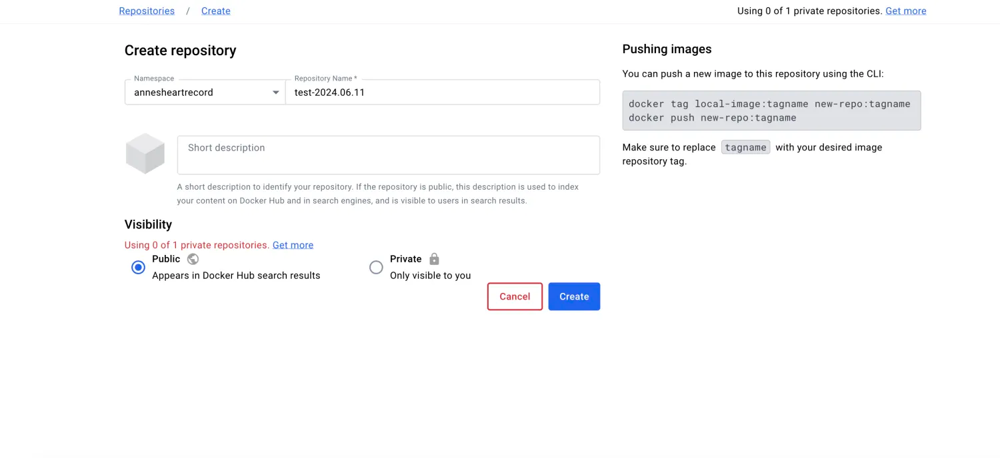
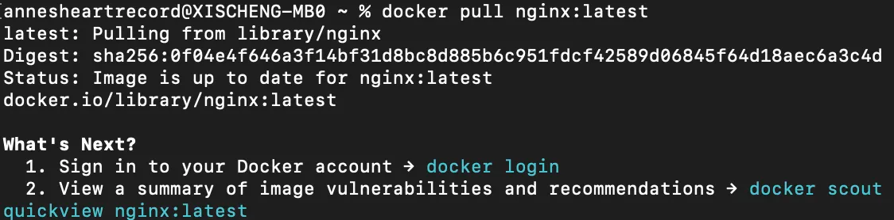
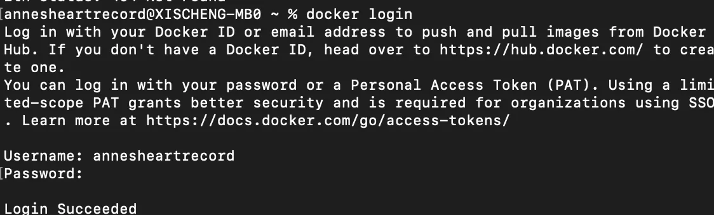
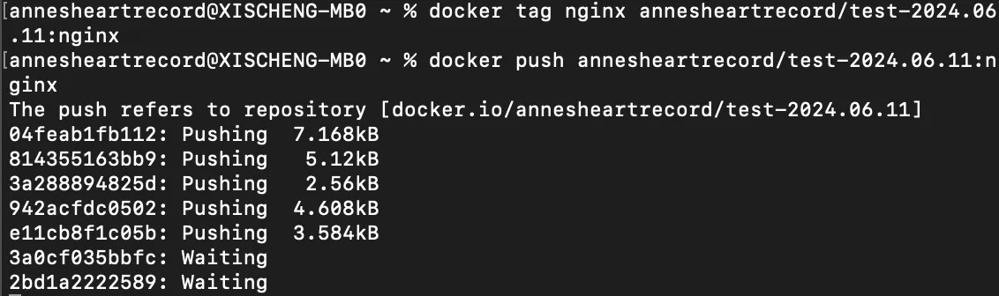
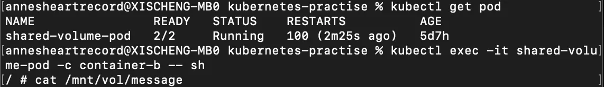
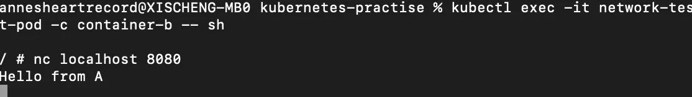

## 前言

在[前文](https://juejin.cn/column/7291519245334347836)中向大家介绍了Pod的一些高级特性，如底层实现、生命周期、探针、宽限期等等，本文将向大家介绍Pod、Image与Container之间的联系与作用，并会通过两则实战带领大家走近镜像与多容器Pod。

## Image 镜像

在k8s中，[镜像](https://kubernetes.io/zh-cn/docs/concepts/containers/images/)是这样被描述的。容器镜像（Image）所承载的是封装了应用程序及其所有软件依赖的二进制数据。镜像是可以执行的软件包，可以单独运行；容器镜像对运行环境有特定的要求。

也就是说，镜像是一个只读的模板，其中包含了应用程序和其运行所需的所有依赖项。由开发人员进行构建、封装、上传，使用时从仓库中拉取。如果不指定仓库的主机名，k8s默认使用的是docker公用仓库docker-hub。通常，在镜像名称后可以添加一个标签tag或者摘要digest来表示镜像的不同版本。摘要是对某版本镜像的哈希值，可以用来标识唯一镜像。

为了确保我们的容器最终运行的是指定版本的镜像，我们可以使用镜像摘要来代替镜像标签， 将 ` <image-name>:<tag>  `替换为`  <image-name>@<digest> `，例如 `image@sha256:45b23dee08af5e43a7fea6c4cf9c25ccf269ee113168c19722f87876677c5cb2`，这样才能完全保证代码版本与环境的一致性。

当我们拉取一个指定版本的镜像，通常会在终端显示这个镜像摘要；在我们上传镜像的时候也会如此，这个摘要唯一的表示了具体某版本的镜像，我们可以通过这个摘要来获取到对应的镜像，如下所示。

```
docker pull ubuntu:22.04

# 终端显示
22.04: Pulling from library/ubuntu
125a6e411906: Pull complete
Digest: sha256:26c68657ccce2cb0a31b330cb0be2b5e108d467f641c62e13ab40cbec258c68d
Status: Downloaded newer image for ubuntu:22.04
docker.io/library/ubuntu:22.04

# pull by digest
docker pull ubuntu@sha256:26c68657ccce2cb0a31b330cb0be2b5e108d467f641c62e13ab40cbec258c68d

docker.io/library/ubuntu@sha256:26c68657ccce2cb0a31b330cb0be2b5e108d467f641c62e13ab40cbec258c68d: Pulling from library/ubuntu
Digest: sha256:26c68657ccce2cb0a31b330cb0be2b5e108d467f641c62e13ab40cbec258c68d
Status: Image is up to date for ubuntu@sha256:26c68657ccce2cb0a31b330cb0be2b5e108d467f641c62e13ab40cbec258c68d
docker.io/library/ubuntu@sha256:26c68657ccce2cb0a31b330cb0be2b5e108d467f641c62e13ab40cbec258c68d
```

### 镜像拉取策略

容器中有一个`ImagePullPolicy`字段，决定着拉取镜像的策略

-   `IfNotPresent`：只有当镜像在本地不存在时才会拉取，这里的本地指的是容器军体运行的node上有没有所需的镜像，如果已经存在则不会从镜像仓库拉取。
-   `Always`：每当kubelet启动一个容器时，kubelet都会查询容器的镜像仓库，将名称解析位一个镜像摘要。如果kubelet有该容器镜像，并且对应的摘要已经在本地缓存，kubelet就会使用缓存的镜像；否则会使用解析后的摘要拉取镜像，如上面的代码所示，并使用该镜像为环境来启动容器。
-   `Never`：kubelet不会尝试获取镜像，如果本地已有镜像则成功运行容器；否则失败。

⚠️ k8s中的容器`imagePullPolicy`是在对象初次创建时设置的，如果后来镜像的标签或摘要发生变化，则不会更新。

如果你想总是强制执行拉取，你可以使用下述的一种方式：

-   设置容器的 imagePullPolicy 为 Always。
-   省略 imagePullPolicy，并使用 :latest 作为镜像标签； 当你提交 Pod 时，Kubernetes 会将策略设置为 Always。
-   省略 imagePullPolicy 和镜像的标签； 当你提交 Pod 时，Kubernetes 会将策略设置为 Always。
-   启用准入控制器 [AlwaysPullImages](https://kubernetes.io/zh-cn/docs/reference/access-authn-authz/admission-controllers/#alwayspullimages)。

当kubelet使用容器运行时组件创建Pod时，容器可能因为ImagePullBackOff状态导致状态为Waiting，因为Kubernetes无法拉取容器镜像（原因包括无效的镜像名称，或从私有仓库拉取而没有 imagePullSecret）。BackOff 部分表示 Kubernetes 将继续尝试拉取镜像，并增加回退延迟。Kubernetes会增加每次尝试之间的延迟，直到达到编译限制，即300秒。

拉取镜像是Node上的kubelet组件来完成的，每个工作节点上都会有kubelet组件，它以守护进程`daemon`的方式运行，负责与控制平面通信，并管理具体工作节点上的pod和容器。默认情况下，kubelet以串行的方式拉取镜像，一次拉取一个镜像，我们可以配置kubelet中的`serializeImagePulls`字段来启用并行拉取，这个并行并不是一个pod中的容器并行拉取。例如，如果你有一个 Pod，它有一个初始容器和一个应用容器，那么这两个容器的镜像拉取将不会并行。 但是，如果你有两个使用不同镜像的 Pod，当启用并行镜像拉取时，kubelet 会代表两个不同的 Pod 并行拉取镜像。

### 实战 拉取与上传镜像

1.登陆docker-hub

2.创建一个仓库



3.`docker pull nginx:latest`拉取nginx镜像



4.终端登陆docker-hub



5.上传镜像



## Pod、Image、Container的联系

如果我们将镜像`Image`看成一个固定的、不可修改的、只读的模板，包含了程序主体以及所有的依赖、库、配置等等，那么容器就是一个镜像的运行时的实例，它是一个轻量级、独立、可移植的运行环境，包含了应用程序和它的所有依赖项。

当启动容器时，实际上是读取出镜像中的具体内容，然后加载程序及相关的配置在内存中运行。

我们可以从以下几点来体会镜像和容器的关系。

**镜像是容器的基础**

-   镜像中包含了创建容器所需的所有文件和配置
-   当运行一个容器时，实际上是基于镜像创建了一个独立的、可运行的环境

**不可变性**

-   镜像是只读、不可变的，一旦创建就不能修改，修改后的镜像和原镜像不是同一份镜像
-   容器上镜像的可变运行实例，可以在运行时进行读写操作，但这些修改不会反映回原始镜像

**分层存储**

-   镜像由Dockfile等配置文件构成，而Dockerfile里采用了多阶段构建的技术，通常定义了从基础镜像开始，逐步添加应用程序和依赖的过程，这里的每一步都对应着镜像构建中的一层，每一层都是只读的
-   容器在启动时，会在镜像的只读层上添加一个可写层，这样所有的写操作都只影响容器，而不修改镜像。

在k8s官方文档中，对于`Pod`是这样定义的。`Pod`**是 Kubernetes 中创建和管理的、最小的可部署的计算单元**，**可以包含一组（一个或多个）容器。这些容器共享存储、网络、一级怎样运行这些容器的声明。**

Kubernetes 集群中的 Pod 主要有两种用法：

-   **运行单个容器的 Pod**。"每个 Pod 一个容器" 模型是最常见的 Kubernetes 用例。在这种情况下，可以将 Pod 看作单个容器的包装器。Kubernetes 直接管理 Pod，而不是容器。
-   **运行多个需要协同工作的容器的 Pod**。 Pod 可以封装由多个紧密耦合且需要共享资源的并置容器组成的应用。 这些位于同一位置的容器可能形成单个内聚的服务单元。

上述的单容器和多容器，其实对应着的就是单镜像和多镜像。或者说，镜像对应着的才是容器，容器是镜像的运行实例。一个Pod含有几个镜像，最终就会运行几个容器，二者一一对应。如果一个 Pod 具有多个镜像，这通常意味着这个 Pod 会启动多个不同的容器。每个容器可能运行不同的应用程序或服务，但它们共享同一个 POD 的资源。因此，如果一个 Pod 下有多个镜像，那么相应的每个 POD 中会运行这些镜像对应的多个容器，这些容器一起组成了该 POD。

一个 `POD` 中的容器可以共享同一网络和存储卷，这种设计使得它们能够相互之间快速地通信和共享资源。这意味着它们之间可以:

-   直接通过localhost进行通信，A容器访问B容器就像访问本地一样
-   如果共享一个卷，那么A容器可以直接访问B容器内的文件
-   A\B容器运行在同样的容器运行时环境中

### 实战 多镜像Pod共享资源

#### 存储资源

首先创建一个有共享卷的`pod`，然后我们进入到`b`容器的内部，能看到：`b`容器中的文件能感知到`a`容器对其的修改，证明a、b容器共享卷中的文件。

```
apiVersion: v1
kind: Pod
metadata:
  name: shared-volume-pod
# 两个容器 a容器往文件中写了一个echo Hello from A字符串
# 两个容器都使用了 shared-storage 卷
spec:
  containers:
  - name: container-a
    image: alpine
    command: ['sh', '-c', 'echo Hello from A > /mnt/vol/message; sleep 3600']
    volumeMounts:
    - name: shared-storage
      mountPath: /mnt/vol
  - name: container-b
    image: alpine
    command: ['sh', '-c', 'sleep 3600']
    volumeMounts:
    - name: shared-storage
      mountPath: /mnt/vol
  volumes:
  - name: shared-storage
    emptyDir: {}
```



`kubectl exec -it network-test-pod -c container-b -- sh`这个命令的含义如下

-   kubectl exec 在指定pod内部执行命令
-   -it 进入容器内部的交互模式 在容器中运行一个交互式的shell
-   -c 指定目标容器
-   -- sh 启动一个shell

#### 网络资源

```
apiVersion: v1
kind: Pod
metadata:
  name: network-test-pod
spec:
# 两个容器 a 安装netcat工具，并且启动一个tcp服务器，监听8080端口并回显示“hello from a”
# b 也需要安装netcat
  containers:
  - name: container-a
    image: alpine
    command: ['sh', '-c', 'apk add --no-cache nc; nc -lk -p 8080 -e echo "Hello from A"']
  - name: container-b
    image: alpine
    command: ['sh', '-c', 'apk add --no-cache nc; sleep 3600']
```

进入b容器内部，通过`netcat`工具请求本地8080端口，收到来自a容器的响应，证明a、b共享网络资源。



## 结语

这篇博客主要介绍了`Image`相关概念，带领大家由浅入深了解`Pod`、`Image`与`Container`之间的联系与作用。

《每天十分钟，轻松入门K8S》的第10篇**10.源码级别Pod详解（六）： Pod、Image与Container**到这里就结束了，之后的几讲都会和`Pod`相关，深入源码级别探索K8S核心概念`Pod`相关内容，感兴趣的朋友欢迎**点赞、评论、收藏、订阅，您的支持就是我最大的动力。**

## 推荐阅读

[**08.源码级别Pod详解（四）： Pod readiness与Container Probe**](https://juejin.cn/post/7307542269674651682)

[**06.源码级别Pod详解（三）：Container 生命周期**](https://juejin.cn/post/7296303730772656162)

[**05.源码级别Pod详解（二）：Pod生命周期**](https://juejin.cn/post/7295565904406511657)

[**02.K8S架构详解**](https://juejin.cn/post/7292323577210404915)
