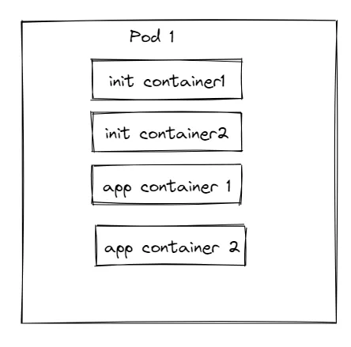
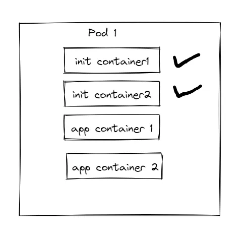
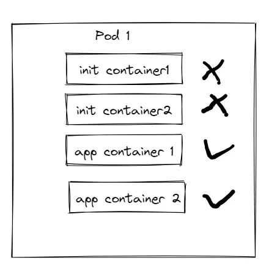
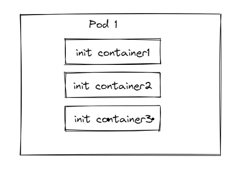
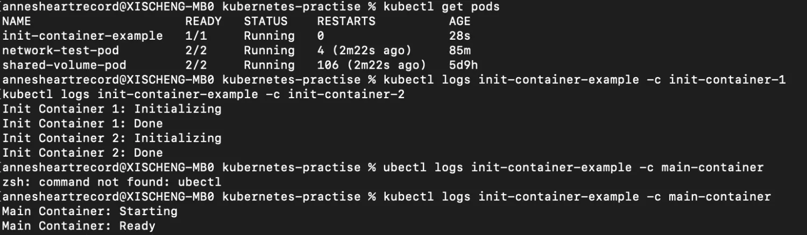

## 前言

`Init Containers`是一个或者一组专用的容器，在业务容器`app containers`之前启动运行，`app containers`是我们认为的业务容器，即专门干活的容器。我们可以在`pod spec`中使用一个数组声明`init Containers`。

对于`Init Containers`最准确的定义是：**在Pod初始化期间到真正运行期间，启动并完成的容器**。

## Init Container

一个Pod可以拥有多个内部运行的app containers，同样它也可以具有一个或者一组Init containers，这些init containers会在app containers启动之前运行。

通常Init Containers和普通的容器一样，除了以下两点

-   它们总是运行到完成
-   必须在下一次启动之前结束

如果一个Pod的init container启动失败，那么kubelet会一直重启它们，直到成功为止。同时，如果Pod内部的容器重启策略为Never，并且有任何一个init container启动失败，那么k8s就认为整个pod启动失败。

init container是一个数组，被声明在pod spec中，状态则被包含在`.status.initContainerStatuses`中。

Init container和普通容器一样，支持所有普通容器的特性，如：资源的limit和request限制，挂载数据卷、安全组设置等等。

同时Init 容器不支持lifecycle 以及各类probe，因为它们必须在Pod就绪之前运行完成。

如果为一个Pod指定了多个Init容器，这些容器会按照顺序逐个运行，每个Init容器必须运行成功，下一个才能够运行。当所有的Init容器运行完成时，K8S才会为Pod初始化应用容器并像平常一样运行。



启动顺序



然后退出


之后才是业务容器启动



Init Container在主容器启动之前运行，主要用于执行初始化任务，如加载配置文件，准备数据，或等待其他服务的启动。

**启动时机**

-   在Pod启动过程中，Init Container将在应用容器之间按照顺序启动
-   每个Init Container都必须成功完成（退出码为0），才能继续启动下一个Init Container或者启动主容器
-   如果有一个Init Container，整个Pod的启动将被阻塞



假设有这么三个初始化容器，在pod spec中规定了启动顺序为1、2、3，那么它们机会按照1、2、3的顺序依次启动。

如果一个Init Container失败，kubelet会阻止后续的init container启动，以及主应用容器的启动。整个Pod会被阻塞，直到手动修复问题或者删除Pod以重新启动。这种设计可以确保在主应用容器启动之前，先完成必要的初始化任务，从而有助于维护整个Pod的一致性状态。

如果希望某些Init Container的失败不阻止其他Init Container的执行，可以将failurePolicy属性改成Ignore，这样就可以忽略失败。

在所有的Init容器没有成功之前，Pod将不会变成Ready状态，如果Pod重启，所有的Init容器必选重新执行。同时，因为Init容器可能会被重启、重试，所以里面的代码应该是幂等的。

## 使用Init容器

因为Init容器具有与应用容器分离的单独镜像，其启动相关代码具有如下优势：

-   Init容器可以包含一些安装过程中应用容器中不存在的的实用工具或者个性化代码，例如没有必要仅为了在安装过程中使用类似`sed` `awk` `python`这类工具而去`from`一个镜像，生成一个新的镜像
-   应用镜像的创建者和部署者可以各自独立工作，而没有必要联合构建一个单独的应用镜像。
-   与同一Pod种的多个应用容器相比，Init容器能以不同的文件系统视图运行，因此Init容器可以被赋予应用容器中不能访问的Secret的权限
-   由于Init容器必须在应用容器启动之前运行完成，因此Init容器提供了一种机制来阻塞或延迟应用容器的启动，直到满足了一组先决条件。一旦前置条件满足，Pod内的所有的应用容器会并行启动。
-   Init容器可以安全地运行实用程序或者自定义代码，而在其他方式下运行这些内容可能会降低应用容器镜像的安全性

在Pod启动过程中，每个Init容器会在网络和数据卷初始化之后按照顺序启动，kubelet运行依据Init容器在Pod spec中出现的顺序依次运行。

在所有的Init容器没有成功之前，Pod不会变成Ready状态，Init容器的端口不会再Service中聚集。如果Pod重启，那么所有的Init容器必须重新执行。

因为Init容器可能会被重启或重新执行，所以里面的代码应该是幂等的。

```
apiVersion: v1
kind: Pod
metadata:
  name: init-container-example
spec:
  initContainers:
  - name: init-container-1
    image: alpine
    command: ['sh', '-c', 'echo Init Container 1: Initializing; sleep 5; echo Init Container 1: Done']
  - name: init-container-2
    image: alpine
    command: ['sh', '-c', 'echo Init Container 2: Initializing; sleep 5; echo Init Container 2: Done']
  containers:
  - name: main-container
    image: alpine
    ports:
    command: ['sh', '-c', 'echo Main Container: Starting; sleep 10; echo Main Container: Ready']
```



通过上面这个例子我们能看出整个pod启动时不同容器运行启动的顺序。

## 结语

这篇博客主要介绍了`Init Container`相关概念。《每天十分钟，轻松入门K8S》的第11篇**11.源码级别Pod详解（七）:Init 容器r**到这里就结束了，之后的几讲都会和`Pod`相关，深入源码级别探索K8S核心概念`Pod`相关内容，感兴趣的朋友欢迎**点赞、评论、收藏、订阅，您的支持就是我最大的动力。**

## 推荐阅读

[**08.源码级别Pod详解（四）： Pod readiness与Container Probe**](https://juejin.cn/post/7307542269674651682)

[**06.源码级别Pod详解（三）：Container 生命周期**](https://juejin.cn/post/7296303730772656162)

[**05.源码级别Pod详解（二）：Pod生命周期**](https://juejin.cn/post/7295565904406511657)

[**02.K8S架构详解**](https://juejin.cn/post/7292323577210404915)
