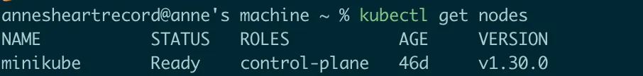
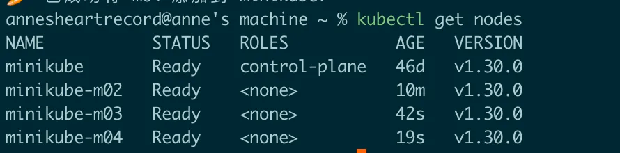
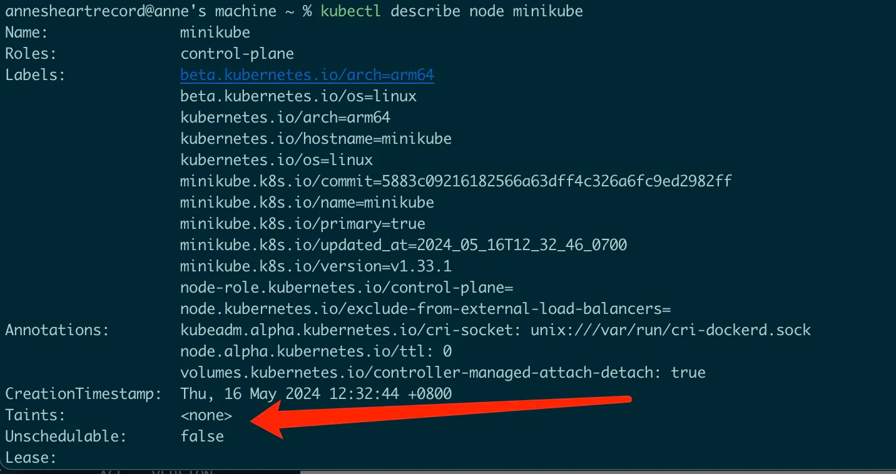
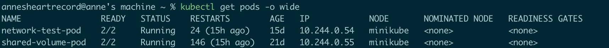
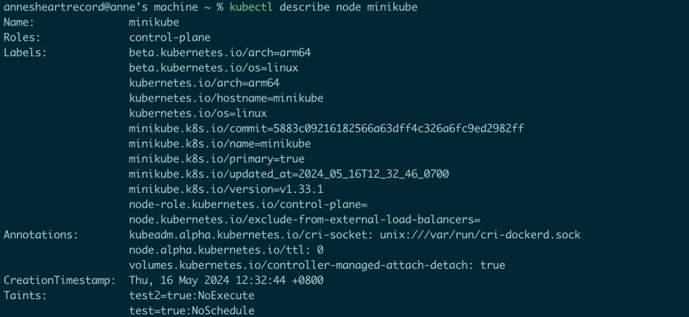
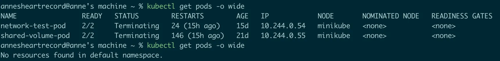

## 污点 Taint

污点的作用就像一个过滤器，能够使节点排斥一些Pod，它是一个作用于Node的键值对；熟悉K8S的同学可能立马能想到有一个相反作用的属性叫做节点亲和性`Affinity`，作用于Pod，使得Pod能够被吸引到一类特定的节点。

### 污点类型

根据`effect`值的不同，我们可以把污点分为三类，程度从高到低依次为

**NoExecute**

会影响已经在节点上运行的Pod

-   如果Pod没有对应的容忍度，会被驱逐
-   如果Pod有对应的容忍度，容忍度没有设置`tolerationSeconds`，则会一直在该节点上运行
-   如果Pod有对应的容忍度，容忍度设置了`tolerationSeconds`，则会在到期后被驱逐

**NoScedule**

影响的是即将调度的Pod，如果Pod没有对应的容忍度则不会被调度到该节点上，不会影响正在节点上运行的Pod

**PreferNoSchedule**

是一个削弱版的`NoScedule`，影响的是即将调度的Pod，会尝试将Pod不调度到该节点上，但不能保证完全避免

### 删除和添加污点

**添加污点**

`kubectl taint nodes node1 key1=value1:NoSchedule`

给node1节点添加一个键名为key1，值为value1的键值对，`effect`的值是`NoSchedule`，作用和直译过来一样，就是不调度，只有具有和这个污点相匹配的容忍度的Pod才会被调度到这个节点上。

`key+value+effect`这三个字段构成了一个污点，只要其中有一个值不同，那么就是两个不同的污点，例如

```
kubectl taint nodes node1 key1=value1:NoSchedule
kubectl taint nodes node1 key1=value1:NoExecute
```

这就是两个不同的污点，第一个污点作用是不让Pod调度到Node上，第二个污点作用是让已经在Node上运行的Pod被驱逐。

**删除污点**

`kubectl taint nodes node1 key1=value1:NoSchedule-`

K8S调度器在选择一个节点来运行Pod时会考虑到污点和容忍度，然而如果你手动为Pod指定了`.spec.nodeName`，那么选节点的操作会绕过调度器，无论节点有没有`NoSchedule`污点，都会将这个Pod调度到指定的节点上。如果节点有`NoExecute`的污点，那么kubelet会将Pod再驱逐出去。

### 内置污点

前内置的污点包括：

-   `node.kubernetes.io/not-ready`：节点未准备好。这相当于节点状况 Ready 的值为 "False"。
-   `node.kubernetes.io/unreachable`：节点控制器访问不到节点. 这相当于节点状况 Ready 的值为 "Unknown"。
-   `node.kubernetes.io/memory-pressure`：节点存在内存压力，控制平面监测到节点状态缺乏内存资源，则会为Node添加这个污点。
-   `node.kubernetes.io/disk-pressure`：节点存在磁盘压力，同上。
-   `node.kubernetes.io/pid-pressure`：节点的 PID 压力，同上。
-   `node.kubernetes.io/network-unavailable`：节点网络不可用，同上。
-   `node.kubernetes.io/unschedulable`：节点不可调度，同上。
-   `node.cloudprovider.kubernetes.io/uninitialized`：如果 kubelet 启动时指定了一个“外部”云平台驱动， 它将给当前节点添加一个污点将其标志为不可用。在 cloud-controller-manager 的一个控制器初始化这个节点后，kubelet 将删除这个污点。


## 容忍度 Toleration

容忍度`Toleration`是应用于Pod的属性，它也是一个`key:value`键值对，还能附带额外的属性`effect、operator、tolerationSecond`，`operator`默认为`equal`，`tolerationSecond`默认不设置，容忍度能够允许调度器将Pod调度到具有相应污点的节点上，但并不保证调度，因为调度器也会评估其他参数。

一个容忍度和一个污点相匹配，指的是

-   当容忍度的`operator`为`equal`时，容忍度和污点的`key+value+effect`都匹配
-   当容忍度的`operator`为`exists`时，容忍度和污点的`key+effect`匹配，此时容忍度无法设置`value`字段

污点和容忍度相互配合，可以实现一个双向的过滤器，用来避免Pod被分配到不合适的节点上。在调度某个Pod时会从一个节点的所有污点开始遍历，过滤掉存在容忍度相匹配的容忍度的污点，剩下的没有被过滤的污点的`effect`值决定了该Pod是否会被分配到该节点上

-   如果至少存在一个`NoSchedule`的污点，那么就不会将Pod调度到该节点
-   如果不存在`NoSchedule`的污点，但存在`PreferNoSchedule`的污点，则会尝试不将Pod调度到该节点
-   如果至少存在一个`NoExecute`的污点，则在调度时不会将Pod调度到该节点，已在该节点上运行的Pod会被驱逐

### 内置容忍度

K8S会为每个Pod添加`node.kubernetes.io/not-ready`和`node.kubernetes.io/unreachable`的容忍度，且配置`tolerationSecond=300`，除非用户自身或者控制器显式的设置容忍度。

## 实战

首先能看到`minikube`初始时只有一个节点，我们通过`minikube node add`命令往集群中添加几个节点，最后结果如下。





看一下添加污点之前的节点以及现在的pod运行情况，能看到现在的两个pod都是运行在`minikube`这个节点上的





为该节点添加两个污点，`effect`分别为`NoSchedule`和`NoExecute`，因为`NoExecute`污点的存在，所以已经运行在该节点上的Pod会被驱逐，符合预期。





对应容忍度的Pod

```
apiVersion: v1
kind: Pod
metadata:
  name: test-taint-pod
spec:
  nodeName: minikube
  containers:
  - name: container-a
    image: alpine:latest
    command: ["sh", "-c", "while true; do echo hello; sleep 10; done"]
  tolerations:
    - key: "test"
      operator: "Equal"
      value: "true"
      effect: "NoSchedule"
    - key: "test2"
      operator: "Exists"
      effect: "NoExecute"
```

## 结语

这篇博客主要介绍了`Taint和Toleration`相关概念。《每天十分钟，轻松入门K8S》的第11篇 **【云原生-K8S】: 污点与容忍度n到这里就结束了**，之后的几讲都会和`Pod`相关，深入源码级别探索K8S核心概念`Pod`相关内容，感兴趣的朋友欢迎**点赞、评论、收藏、订阅，您的支持就是我最大的动力。**

## 推荐阅读

[**08.源码级别Pod详解（四）： Pod readiness与Container Probe**](https://juejin.cn/post/7307542269674651682)

[**06.源码级别Pod详解（三）：Container 生命周期**](https://juejin.cn/post/7296303730772656162)

[**05.源码级别Pod详解（二）：Pod生命周期**](https://juejin.cn/post/7295565904406511657)

[**02.K8S架构详解**](https://juejin.cn/post/7292323577210404915)
