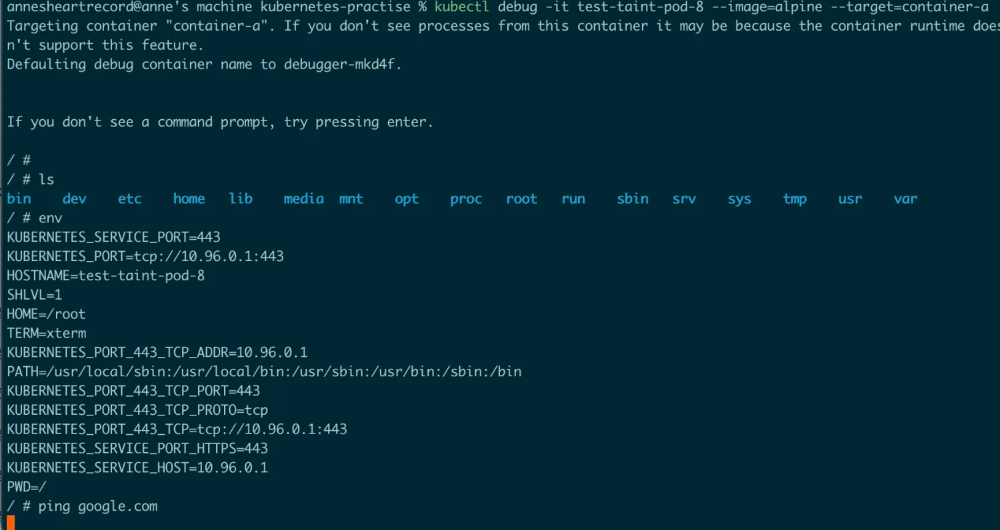

## Ephemeral Containers

对于临时容器Ephemeral Containers最准确的定义是：临时容器是一种特殊的用于`debug`的容器，可以**动态的**添加到Pod中，通常用来对难以复现的问题进行排查，而不对业务有帮助。因为pod由规约控制，一旦pod创建就无法将容器新加到pod中，如果需要对pod的状态进行检查，那么临时容器就派上用场了。

### 临时容器的特征

临时容器和其他容器的不同之处在于

-   不一定能成功执行，不一定有足够的资源执行
-   永远不会自动重启
-   缺少很多配置，例如端口、各类探针、资源相关字段等等

临时容器是`apiserver`使用一个特殊的处理器来创建的，而不是直接添加到pod规约中，因此我们无法使用`kubectl edit`来操作临时容器

与常规容器一样，将临时容器添加到pod之后，将不能更改或删除临时容器，并且静态pod无法使用临时容器，这是因为静态pod直接被`kubelet`管理，而不是被`apiserver`创建，所以通过`apiserver`创建的临时容器并不能被静态pod使用。

## 调试Pod的正确姿势

### 确定状态

调试Pod的第一步应该是查看Pod的详细信息与时间，命令为

`kubectl describe pod ${POD_NAME}`

查看一下Pod中容器所处的状态以及最近的事件，比如容器状态是否为running，最近是否重启过

**Pending**

如果Pod处于`Pending`状态，说明Pod没有被调度到节点上，通常这是因为某种资源类型不足或者各类偏好设置导致的

-   资源不足：内存、CPU的物理资源不足，此时需要删除其他Pod释放资源，或者增加集群的资源
-   偏好设置：比如污点、干扰等会影响到Pod调度的设置，可能会使得哪怕有资源，但是也不满足Pod的调度条件

**Waiting**

如果Pod停滞在`Waiting`状态，说明Pod以及被调度到某个节点上，但是无法在该节点上运行，最常见的情况有

-   镜像拉取失败，比如镜像拼写错误，私有镜像仓库无法访问等问题，可以尝试手动`docker pull`进行拉取镜像的尝试
-   沙箱环境有问题，无法运行Pod

**Terminating**

如果Pod停滞在`Terminating`状态，表示已经发出删除Pod的请求，但是控制平面无法删除该Pod对象，可能是因为某些Pod具有`Finalizer`

**Runnning但是不符合预期**

`Running`表示Pod已经成功启动、运行，如果Pod的行为不符合预期，很大概率是Pod的`.yaml`文件或者管理Pod工作负载的`.yaml`文件出了问题，例如字段的拼写错误、字段的嵌套关系错误等等。

可以通过删除Pod并带上`--validate`选项来重新创建Pod以判断是否有字段的拼写、嵌套错误，例如`kubectl apply --validate -f ${POD_YAML_FILENAME}`

**Crashing**

Crashing状态表示异常的运行，比如某个容器不断的崩溃和重启。这就需要我们调试运行中的Pod。

### 调试运行中的Pod

首先我们用`apply -f`来创建一个新的pod，对应的文件如下

```
apiVersion: v1
kind: Pod
metadata:
  name: test-taint-pod-8
spec:
  nodeName: minikube
  containers:
  - name: container-a
    image: alpine:latest
    command: ["sh", "-c", "while true; do echo hello; sleep 10; done"]
  tolerations:
    - key: "test"
      operator: "Equal"
      value: "true"
      effect: "NoSchedule"
    - key: "test2"
      operator: "Exists"
      effect: "NoExecute"
```

**1.查看POD详情**

通过`kubectl describe pod ${POD_NAME}`命令，比如`kubectl describe pod test-taint-pod-8`

```
Name:             test-taint-pod-8
Namespace:        default
Priority:         0
Service Account:  default
Node:             minikube/192.168.49.2
Start Time:       Tue, 02 Jul 2024 11:43:45 +0800
Labels:           <none>
Annotations:      <none>
Status:           Running
IP:               10.244.0.58
IPs:
  IP:  10.244.0.58
Containers:
  container-a:
    Container ID:  docker://670a600b62339a9459106b064589908571015c68d0a26e2a3113a5dee0a8c3f0
    Image:         alpine:latest
    Image ID:      docker-pullable://alpine@sha256:b89d9c93e9ed3597455c90a0b88a8bbb5cb7188438f70953fede212a0c4394e0
    Port:          <none>
    Host Port:     <none>
    Command:
      sh
      -c
      while true; do echo hello; sleep 10; done
    State:          Running
      Started:      Tue, 02 Jul 2024 11:43:48 +0800
    Ready:          True
    Restart Count:  0
    Environment:    <none>
    Mounts:
      /var/run/secrets/kubernetes.io/serviceaccount from kube-api-access-ftkjg (ro)
Conditions:
  Type                        Status
  PodReadyToStartContainers   True
  Initialized                 True
  Ready                       True
  ContainersReady             True
  PodScheduled                True
Volumes:
  kube-api-access-ftkjg:
    Type:                    Projected (a volume that contains injected data from multiple sources)
    TokenExpirationSeconds:  3607
    ConfigMapName:           kube-root-ca.crt
    ConfigMapOptional:       <nil>
    DownwardAPI:             true
QoS Class:                   BestEffort
Node-Selectors:              <none>
Tolerations:                 node.kubernetes.io/not-ready:NoExecute op=Exists for 300s
                             node.kubernetes.io/unreachable:NoExecute op=Exists for 300s
                             test=true:NoSchedule
                             test2:NoExecute op=Exists
Events:                      <none>
```

`describe`可以给我们提供很多信息，包括关于Pod的事件，Pod和容器的相关配置信息，以及相关状态信息（就绪、状态、重启次数等等）

**2.检查日志**

通过`kubectl logs ${POD_NAME}`来检查Pod的日志，`kubectl logs ${POD_NAME} -c ${CONTAINER_NAME}`来检查Pod下某容器的日志，如果只有一个容器，那么可以不带上第二个参数。如果容器之前崩溃过，可以通过以下命令访问之前容器的崩溃日志

`kubectl logs --previous ${POD_NAME} ${CONTAINER_NAME}`

这个日志的来源有以下几个源头

-   应用程序输出，容器内运行的应用等标准输出会被容器运行时捕获
-   容器运行时：容器运行时会把捕获的日志存储在宿主机的文件系统下，包括一些错误信息，通常路径为`/var/lib/docker/containers/container-id`
-   kubelet：kubelet也会从容器运行时中收集日志

因为我们pod配置的`command`的作用是不断`echo hello`，所以`kubectl log`的结果如下

```
hello
hello
hello
hello
hello
hello
hello
hello
hello
hello
hello
hello
hello
hello
hello
```

**3.使用临时容器**

`kubectl debug`命令可以让我们很容易的创建一个临时容器来进行调试，例如`kubectl debug -it test-taint-pod-8 --image=alpine --target=container-a`

-   -it 交互式终端进入容器
-   test-taint-pod-8: pod name
-   --target:container name
-   --image:临时容器的镜像

之后我们就能进入容器内部，通过各种命令来进行文件、网络、环境变量的调试以确定问题。


## 结语

这篇博客主要介绍了**临时容器和Pod调试**相关操作。《每天十分钟，轻松入门K8S》的第13篇**13.【云原生-K8S】：临时 容器与Pod 调试**到这里就结束了，之后的几讲都会和`Pod`相关，深入源码级别探索K8S核心概念`Pod`相关内容，感兴趣的朋友欢迎**点赞、评论、收藏、订阅，您的支持就是我最大的动力。**

## 推荐阅读

[**08.源码级别Pod详解（四）： Pod readiness与Container Probe**](https://juejin.cn/post/7307542269674651682)

[**06.源码级别Pod详解（三）：Container 生命周期**](https://juejin.cn/post/7296303730772656162)

[**05.源码级别Pod详解（二）：Pod生命周期**](https://juejin.cn/post/7295565904406511657)

[**02.K8S架构详解**](https://juejin.cn/post/7292323577210404915)
