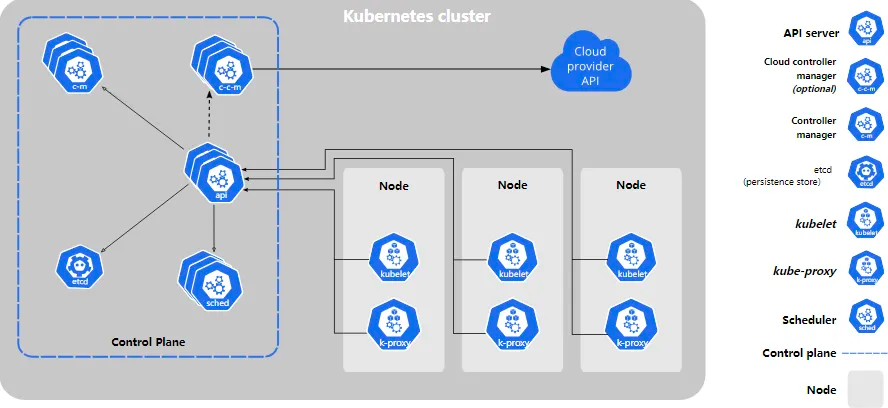
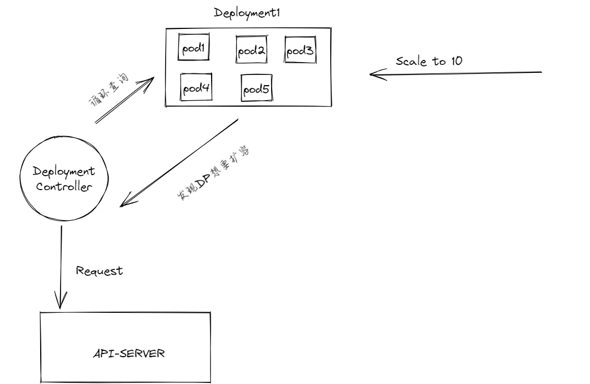
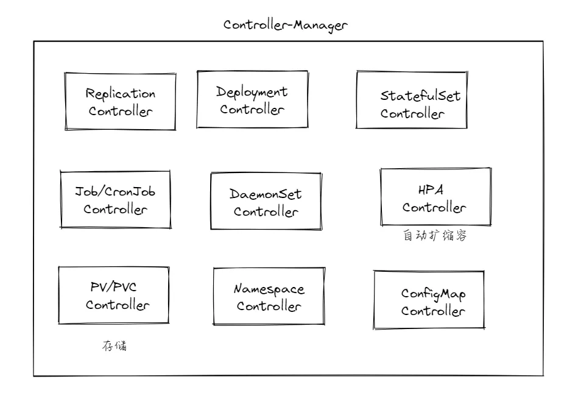
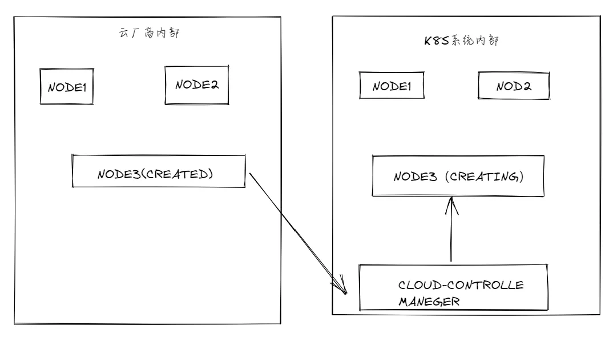

## K8S整体架构


上图包含了K8S中的所有组件，我们把K8S集群分为两个部分，即`Master`节点（主结点）和`Node`节点（工作结点），其中主节点运行着控制平面组件`Control Plane Components`，工作结点运行着必要的`Kubelet`和`Kube-proxy`组件。

K8S采用了分布式、去中心化的架构，由分布式控制平面和多节点的工作节点组成，K8S的核心设计目标之一是高可用性和高伸缩性，因此它并没有采用"一主多从"这种分布式架构模式。

其中，控制平面的组件也可以被部署成多个实例以提供冗余和负载均衡。另外，工作结点之间也是对等的，可以随时向集群中添加或者删除节点。

## 控制平面
 
### API-server

`API-Server`充当了整个K8S集群的入口点，负责接受整个集群的所有内部请求.这里的请求并不是外界访问我们部署的应用的请求，而是**k8s内部通过请求以达到预期的最终状态**，通常涉及更改集群的状态或者管理集群的资源。

比如下图中，某个`deployment`当前的`pod`数量为5，我们使用`kubectl scale deployment my-delpyment --replicas = 10`去手动将这个`deployment`的`pod`数量扩容到10，这时其实是修改了`deployment.spec.deseriedReplicas`字段，它的值会变为10，那么这个预期状态会先被对应的`deployment controller`给发现，然后发送请求给`api-server`进行处理。



在K8S中，每个对象都由四部分组成，即`Api-version、Kind、Metadata、Spec、Status`，其中`Spec`直译过来是规约的意思，我们可以理解**Spec是对象想要达到的状态，Status则是目前的状态**，K8S会努力让`Status`不断变化，直至和`Spec`约定的状态达到一致。

### etcd

`etcd`是一个分布式的`Key-Value`系统，它并不直接参与编排，而是**负责维护集群的配置信息和状态，包括配置、各种对象的状态、服务定义等等**。

例如：

**资源的配置信息**：包括各种对象的定义，如`Deployment、StatefulSet、ConfigMap、Secret`等等，这些配置信息用于定义集群中的资源对象，它们的`Spec、Label`等等。

**实时状态数据**：`etcd`也存储了关于集群中各种资源对象的实时状态数据，这包括有关当前运行的`pod`的信息、资源对象状态、服务的端口映射等等，当这些对象的状态发生更改的时候，`etcd`会记录这些变化，以便K8S内部能获取到最新的状态信息。

同时，在K8S中每个资源对象都有一个`ResoureVersion`字段，代表了该对象的版本号，因为K8S使用乐观并发控制来处理并发访问，这个版本号会在对象发生改变的时候递增。所以当我们手动修改某个对象的时候，比如`kubectl edit deployment my-deployment -n mynamepsace`的时候，有可能保存文件之后提示"因为`resourceVersion`更新对象失败"的提示。

这是因为在修改文件的时候，我们的对象已经被其他因素修改了，并且数据同步到`etcd`中，使得该对象的版本号+1，我们再次保存修改的时候，版本号落后于`ectd`中对象的版本号，于是会修改失败。

**控制平面的内部状态**：包括`controller-manager`的`leader`选举信息、`API-Server`的配置信息等。

### kube-scheduler

`kube-scheduler`**负责将新创建的**`pod`**调度到合适的**`node`**上**，它会考虑多种因素，以确保最后部署的`Node`是最佳选择，比如以下因素。

-   `Node`资源可用性，当前`Node`的资源情况，剩下多少`CPU`、`Memory`、`GPU`资源等等
-   `Pod`和`Node`都可以设置**亲和性和反亲和性规则**，通过`pod`或者`Node`的`Affinity`字段实现，以便实现在调度的时候实现来偏好或者规避`Node`或`pod`
-   结点和容忍性，可以给结点设置污点`Taints`，表明它们不希望接受特定类型的`pod`，同时也可以设置容忍`Tolerations`规则，以接受具有特定污点的`pod`，它们分别通过`Node.Spec.taints`和`Pod.spec.tolerations`字段来声明
-   其他因素：比如，节点的负载均衡，`kube-scheduler`会尽量保证各个节点的负载均衡，以确保不会过度分配负载到某些节点。以及数据的本地性，如果多个节点上有具有所需数据的`pod`，`kube-scheduler`会优先选择哪些本地数据更好的结点，以减少网络传输的需求等策略。

当然，我们也可以编写自定义的调度器拓展，来实现我们想要的定制化`pod`调度策略，例如`pod`不会调度到`cpu`负载超过50%的`Node`上。

### kube-controller-manager

`kube-controller-manager`**中蕴含了各种各样的控制器**，如`Deployment`控制器、`StatefulSet`控制器、`Replication`控制器、`JOB/CornJOB`控制器、`HPA`控制器等等。下图有一个简单的概括，当然，除了这些控制器之外还有其他的控制器。



这些不同的控制器会负责管理、调整其管理的对象，比如`Deployment`就负责管理所有的`Deployment`对象，每一个控制器是一个独立的进程，但是K8S为了降低管理这一系列控制器的复杂度，将它们编译成了同一个二进制文件，并且运行在同一进程里。

这么做也是有原因的，当系统存在多个`controller-manager`的时候，K8S就需要选举出一个控制器的主节点作为集群的`Leader`，其他的节点被认为是从节点，当这些控制器被编译在一个二进制文件中的时候，只需要将这一个`Controller Manager`实例选举为`Leader`即可，而不需要每一种控制器都有自己的`Leader`。

这样的话，成为`Leader`的那个实例将负责执行所有控制器的工作，能够显著降低控制器选主部分的复杂性，保证整个`Controller Manager`和各个`Controller`集群的高可用性和一致性。

### cloud-controller-manager

`cloud-controller-manager`与`kube-controller-manager`类似，也是一个控制器管理器，这个组件主要是和云厂商相关的，如果你是自己搭建的集群，那么就不会有这个组件。

它嵌入了**特定于云平台的控制逻辑**，`cloud-controller-manager`允许你将你的集群连接到云提供商的`API`之上，这是一个可插拔式的组件，**使得不同的云厂商都能够将其平台与K8S集成**。

我们可以把云看成一个系统，K8S看成一个系统，`cloud-controller-manager`组件则是两个系统之间的桥梁，比如云中的虚拟服务器，通过`cloud-controller-manager`被视为K8S中的一个`Node`结点；云中的路由通过`cloud-controller-manager`可能被K8S用来为`Pod`分配`IP`地址等等。

下面这张图能很清晰的看出`cloud-controller-manager`组件的作用，一个刚刚在云平台创建的`NODE`，被`cloud-controller-manager`识别，然后添加进集群内部。



云控制器管理器的控制器包括：

**Node控制器**

节点控制器负载在云基础设施中创建了新服务器时，为之更新节点对象，节点控制器从云提供商获取当前租户中主机的信息，节点控制器执行以下功能：

1.使用从云平台`API`获取的对应服务器的唯一标识符，更新`Node`对象。

2.利用特定云平台的信息为`Node`对象添加注解和标签，例如节点所在的区域，和所具有的资源等等。

3.获取节点的网络地址和主机名。

4.检查节点的健康状态，如果节点无响应，控制器通过云平台API查看该节点是否已从云中、删除或终止。如果节点已经从云中删除，则控制器也会将节点从K8S内部集群中删除。

**Router控制器**

路由控制器负责适当的配置云平台中的路由，以便不同节点上的容器可以相互通信。具体实现取决于各个云供应商，路由控制器也可能为`Pod`分配`IP`地址。

**Service控制器**

服务控制器与云平台的组件集成，如负载均衡器、IP地址、网络包过滤、目标健康检查等等。服务控制器会和云平台提供商的API进行交互，以进行上述组件的配置。

## Work Node

k8s将容器放在`pod`中，再通过`scheduler`将`pod`调度到对应的`Node`上运行，`Node`可以是一台物理机器，也可以是一台虚拟机器（云服务器），这取决于你所在的集群配置。每个节点包含着运行`Pod`所需的所有环节，而所有结点通过控制平面进行管理。

节点上通常需要`kubelet`、`container runtime`、`kube-proxy`三个组件

### kubelet

`kubelet`是每个节点的代理，它会把`Node`注册到K8S集群中，会在集群中的每一个`node`上运行，它保证容器按照期望情况运行在`Pod`中。它接受一组`PodSpecs`，这一组`PodSpecs`用来描述`pod`的期望运行状态，`kubelet`不会管理不是由K8S创建的容器。

也就是说`kubelet`的作用主要有两个，即**确保容器在节点上正确运行**和**与Master节点进行通信**，下面我们从几个方向详解`kubelet`的具体作用。

-   容器生命周期管理：负责创建、启动、停止和销毁容器，根据`Pod`的定义，来保证`Pod`中的容器与期望的状态一致，如果某个容器失败或者终止，`kubelet`会尝试重启，以确保正确运行。
-   资源监控：`kubelet`会定期检查节点上的资源利用情况，然后报告给`Master`。
-   健康检查：`Kubelet`会定期执行容器的健康检查，以确保它们正常运行。如果不健康，则可以重启容器或者通知`Master`节点以采取措施。
-   与API-Server通信：通过与`API-Server`的通信来同步本`Node`上的对象状态更新，以及获取其他对象的更新。

例如我们通过下面这个`.yaml`文件创建一个很简单的`Pod`

```
apiVersion: v1
kind: Pod
metadata: 
	name: my-pod 
spec:
	containers:
	- name: container-1
  	image: nginx
```

在成功创建这个`Pod`之后，`Kubelet`会定期监控`container-1`容器的健康状态，以确保它能够正常运行；并且会定期向`Master`报告节点的资源使用情况，如果容器崩溃或者终止，`kubelet`会尝试重启它，以确保Pod中的容器处于预期状态。

此外，如果想要做到更细粒度的资源监控，比如`Deployment`、`Pod`、容器级别，那么单单靠`Kubelet`是不行的，可以通过访问`API-Server`，或者使用其他工具进行数据上报，比如`Prometheus`、`Grafana`等等。

### kube-proxy

`kube-proxy`是集群每个`Node`上运行的网络代理，以确保`Pod`之间的通信，以及`Pod`和集群外部的通信是正常的。

它会维护节点上的一些网络规则，这些规则会允许从集群内部或者外部的网络与`Pod`进行通信，以便将流量路由到正确的Pod。

如果操作系统提供了可用的数据包过滤层，则`kube-proxy`会通过它来实现网络规则。否则，`kube-proxy`只做流量转发的功能。

-   服务代理：充当了服务和后端`Pod`之间的中介，接受流量并传递给对一个的`Pod`，客户端只需要知道服务的名称或者`ClusterIP`，而不需要知道后端Pod的详细信息。
-   负载均衡：根据不同的负载均衡策略将请求分发给对应的后端`Pod`。
-   集群外部访问：可以将外部流量路由到集群内部的服务。

### Container Runtime

`container-Runtime`组件使得K8S拥有容器运行的环境和条件，从而能够有效运行容器。它负责管理K8S环境中容器的执行和生命周期。

K8S支持许多容器运行环境，如`containerd`、`CRI-O`以及`Kuberenetes CRI`等等。

K8S早期版本仅仅适用于`Docker Engine`这一种特定的容器运行时，后来增加了对其他类型的容器运行时的接口，因此设置了`CRI`标准接口来和各种各样的容器运行时进行交互，它包括了容器运行时的接口和镜像的接口，我们可以看看这些接口的定义。

```
service RuntimeService {  //Runtime的grpc接口 
    rpc Version(VersionRequest) returns (VersionResponse) {}
    rpc RunPodSandbox(RunPodSandboxRequest) returns (RunPodSandboxResponse) {}
    rpc StopPodSandbox(StopPodSandboxRequest) returns (StopPodSandboxResponse) {}
    rpc RemovePodSandbox(RemovePodSandboxRequest) returns (RemovePodSandboxResponse) {}
    rpc PodSandboxStatus(PodSandboxStatusRequest) returns (PodSandboxStatusResponse) {}
    rpc ListPodSandbox(ListPodSandboxRequest) returns (ListPodSandboxResponse) {}
    rpc CreateContainer(CreateContainerRequest) returns (CreateContainerResponse) {}
    rpc StartContainer(StartContainerRequest) returns (StartContainerResponse) {}
    rpc StopContainer(StopContainerRequest) returns (StopContainerResponse) {}
    rpc RemoveContainer(RemoveContainerRequest) returns (RemoveContainerResponse) {}
    rpc ListContainers(ListContainersRequest) returns (ListContainersResponse) {}
    rpc ContainerStatus(ContainerStatusRequest) returns (ContainerStatusResponse) {}
    rpc UpdateContainerResources(UpdateContainerResourcesRequest) returns (UpdateContainerResourcesResponse) {}
    rpc ReopenContainerLog(ReopenContainerLogRequest) returns (ReopenContainerLogResponse) {}
    ...
}
```

```
service ImageService { //镜像的grpc接口 
    rpc ListImages(ListImagesRequest) returns (ListImagesResponse) {}
    rpc ImageStatus(ImageStatusRequest) returns (ImageStatusResponse) {}
    rpc PullImage(PullImageRequest) returns (PullImageResponse) {}
    rpc RemoveImage(RemoveImageRequest) returns (RemoveImageResponse) {}
    rpc ImageFsInfo(ImageFsInfoRequest) returns (ImageFsInfoResponse) {}
}
```

上面的这些接口都是容器运行时需要暴露给`Kubelet`的接口，`Docker Engine`没有实现`CRI`接口，所以当K8S创建了`CRI`标准之后，手动创建了部分特殊代码来帮助`Docker Engine`过度，也就是`dockershim`。

K8S在`v1.20`版本宣布移除`dockershim`，`v1.24`版本K8S正式移除了`dockerShim`，为什么要这么做呢？

从可拓展性的角度看，K8S通过引入新的容器运行时接口将容器管理与具体的运行时解耦，不再依赖某个具体的运行时实现。另外，`Docker`也不打算支持K8S中的`CRI`接口，需要K8S社区在仓库中维护`Dockershim`。此外，在较新的 `CRI` 运行时中实现了与 `dockershim` 不兼容的功能，例如 `cgroups v2` 和用户命名空间。 从 `Kubernetes` 中移除 `dockershim` 允许在这些领域进行进一步的开发。

## 如何实现K8S的高可用

工作结点：因为`scheduler`在调度`pod`的时候有自动调动策略，通常如果某个`node`失效，会自动将`pod`部署在其他`node`上，所以`node`结点我们无需额外处理，只要集群拥有足够多的`node`结点，运行情况就会很稳定

api-server、scheduler:负责接受请求 是一个无状态的服务，所以我们可以起多个`api-server`实例，然后通过负载均衡器让请求均匀的打到所有的`api-server`上去，既能提高可用性，也能降低单个`api-server`的压力，提升请求处理速度

ectd、kube-controller-manager:可部署多个实例，它们内部会选出主节点

## 结语

《每天十分钟，轻松入门K8S》的第二篇**02.K8S架构详解**到这里就结束了，感谢您看到这里。

在下一篇中我会带着大家搭建K8S环境，真正开始K8S的具体操作，感兴趣的小伙伴欢迎**点赞、评论、收藏**，您的支持就是对我最大的鼓励。
