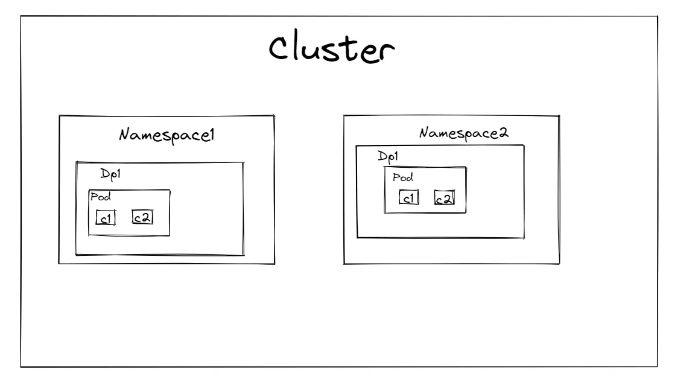
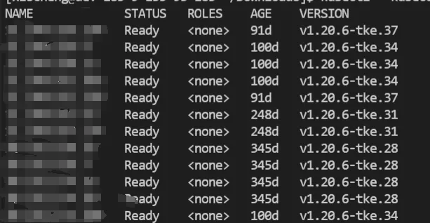
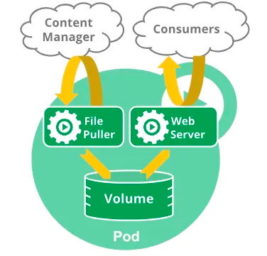

## Cluster

在K8S中，`Cluster`是一个核心概念，它代表了**整个K8S管理的节点、命名空间、各类对象和资源的集合**，在K8S中，一个`Cluster`至少包含一个工作结点和一个主节点，这些结点是运行在K8S系统的服务器或者虚拟机，目标是提供一个同一的视图，使得K8S集群成为一个单一的大型计算资源。

也就是说`Cluster`是K8S中最大的集合，我们平常说的一个K8S集群，指的就是某个`Cluster`，里面可能有几十个`Namespace`，上百个`Workload Resource`，成千上万个`Pod`以及万级别甚至更大量级的`Container`。也就是说在虚拟层面的角度来看，他们之间的关系是像下面这样的。

在K8S内部中属于集群（Cluster）级别的资源有:`Node`、`Namespace`、`Event`、`Lease`、`RuntimeClass`等等，也就是这些对象是直接被Cluster进行管理的。

## Kubectl

命令行工具，能够在K8S集群中运行命令来操作K8S集群内部，本质上还是以请求的方式和`Api-Server`进行交互。

我们可以用`kubectl get nodes`命令来获取当前集群的所有的节点，通过`kubectl get namespace`来获取命名空间，通过`kubectl get event`来获取当前命名空间的事件等等。

## Namespace

`Namespace`并不是K8S独有的概念，很多系统和工具都有`Namespace`的实现，比如Linux OS，但他们的功能都是类似的：提供逻辑分区和隔离。

在K8S中`Namespace`是一个虚拟的、逻辑上的分区，用于**将一个庞大的K8S集群划分为多个小的、逻辑集群**，每个`Namespace`都有自己的资源配额、权限控制等等，主要还是想提供一个多租户环境，防止用户之间的资源冲突，提供资源配额管理，方便安全隔离等等。

很多K8S中的资源都是`Namespace`级别的，比如说`Workload resource`、`Config map`、`Volume`、`HPA`等等资源对象。

我们可以使用`kubectl`来查看`Namespace`下的一些资源，这也是我们平常用的最多的一些命令，

例如：

使用`kubectl get pods -n namespace`获取对应的`pods`

`kubectl get deployments -n namespace`来获取对应的`deployments`

`kubectl get event -n namespace`来获取对应的事件等等。

在`Cluster`中有两个`Namespace`比较特殊，分别是`default`和`kube-system`。

当创建资源的不指定`Namespace`时，默认会把对应的资源放在`default`中；而K8S自己创建的系统资源会放在`kube-system`中，比如控制平面组件`kube-scheduler`、`kube-apiserver`、`kube-controller-manager`、`etcd`等等。

## Pod

`Pods are the smallest deployable units of computing that you can create and manage in Kubernetes.`

这句话是K8S官方文档对于`Pod`的定义，意为：`Pod`**是K8S中可创建、管理、部署的最小单元**。

`Pod`直译过来是豌豆荚的意思，本质上是对容器`Container`的封装，下面这张图就能很清晰的表示出`pod`和`container`之间的关系。

K8S引入`Pod`主要基于下面两个目的：

1.  可管理性：有些容器天生就需要紧密联系，一起工作。`Pod`提供了比容器更高层次的抽象，将它们封装到一个部署单元中。以`Pod`为最小单位进行调度、扩展、共享资源、管理生命周期等。
1.  通信和共享资源：`Pod`中的所有容器共享同样的网络资源，即`Ip`地址和`Port`空间，它们之间可以直接用`localhost`通信。同样的，当K8S挂载`volume`到`Pod`，`volume`对于该`Pod`下的所有容器都是可见的，本质上是将`volume`挂载到`Pod`的每一个容器。

一个`Pod`中可以有一个或者多个`Container`，这些容器共享某些资源，例如存储、网络、环境变量和配置，除了具体运行的业务容器之外，还可以为`Pod`设置初始化容器`Init Container`，只有这些初始化容器运行成功了才会启动业务容器。

并且我们通常不直接部署`Pod`，而是通过工作负载资源`Workload Resources`（老版本也叫`Controller`，现在不推荐这么叫）来部署`Pod`，它们是对`Pod`的封装，负责让`Pod`的状态靠近期望状态。

比如使用`Deployment`用来运行无状态的`Pod`，`StatefulSet`用来运行有状态的`Pod`，`DaemonSet`一次只能运行一个`Pod`，通常用来运行守护进程、监控、数据采集上报等等服务，`Job/CronJob`则分别运行一次性任务和定时任务等等。

K8S中的`pod`有两种使用方式：单容器和多容器

-   单容器：`Pod`使用最常见的一种方式，在这种方式里，你可以简单的把`Pod`认为是容器的封装，没有什么本质区别，只是K8S调度`Pod`而不直接调度`Container`而已。
-   多容器：多个容器协同工作，这些容器被认为是强关联、紧耦合的，比如一个容器的作用是保存文件到卷中，另一个容器则更新这些文件，这个`Pod`封装了这些容器，向他们提供共享的存储、网络等资源，并被视为一个最小单元。

[K8S官方文档](https://kubernetes.io/zh-cn/docs/concepts/workloads/pods/)举了一个例子：一个`Pod`中有两个容器，其中一个是作为`web server`，将共享存储卷的文件对外开放，然后另一个容器作用是更新这些文件，即作为一个生产者。

`Pod`已经是K8S中可管理、调度的最小单位了，K8S只能管理到这个层面，所以一个`Pod`内的容器都是统一调度的，比如不可能出现容器A在节点A上，容器B在节点B上的情况，这些容器可以共享他们的资源和依赖，并且与其他容器交换信息。

有一些`Pod`还会有自己的`init containers`，必须要在`init`容器完成运行之后，才会去启动其他`app containers`。

当容器重启的时候，`Pod`并不会跟随着重启，因为`Pod`本质上不是一个进程，而是一个为容器提供的运行环境，`Pod`会一直存在，直到被删除。

## 结语

《每天十分钟，轻松入门K8S》的第二篇**03.你不得不知道的K8S核心概念**到这里就结束了，感谢您看到这里。

之后的几讲都会和`Pod`相关，深入源码级别探索K8S核心概念`Pod`相关内容，感兴趣的小伙伴欢迎点赞、评论、收藏，您的支持就是对我最大的鼓励。
