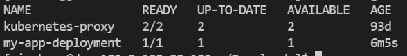
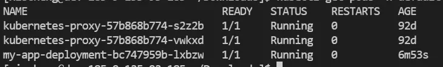

## 前言

K8S使用的`API`风格为**声明式API**，声明式API更加容易理解与维护，因为它们隐藏了底层的实现细节、我们通过`yaml`文件这种方式去创建、声明对应的对象，在K8S中的每一个对象都对应着一个`yaml`文件，即通过文件完成一次声明，而不是像命令式`API`一样通过一条条命令进行`API`请求交互。

每一个创建对象的`yaml`文件由又四部分组成，分别是`APIVersion`、`Kind`、`Metadata`和`Spec`，而一个已经存在的对象则会多一个`status`部分用于标识对象的当前状态。

## 实战

我们以创建一个最简单的`Deployment`对象来进行实验，因为我们不直接部署`Pod`，而是通过更高一层的抽象:` Workload Resource  `(老版本也叫`Controller`)来进行对`Pod`的控制。

首先创建一个如下的`my-app-deployment.yaml`，这个`Deployment`旨在部署一个`pod`，这个`pod`只有一个容器，容器中运行着`nginx`服务。工作负载资源在创建`Pod`的时候，会按照`pod`模板里面的内容来创建实际的`pod` 。

```
# 指定apiVersion
apiVersion: apps/v1
# 指定对象类型
kind: Deployment
# 元数据 这里只给了必须的name 
metadata:
  name: my-app-deployment
# 规约：即期望状态 
spec:
	# pod数量=1
  replicas: 1
  # 选择标签为"my-app"的pod 
  selector:
    matchLabels:
      app: my-app
	# pod 模板 同样包含了元数据和规约
  template:
    metadata:
    	# 带上标签
      labels:
        app: my-app
    spec:
      containers:
      - name: nginx-container
        image: nginx:latest
        ports:
        - containerPort: 80
```

`kubectl apply -f my-app-deployment.yaml`创建这个`Deployment`。

然后`kubectl get deployment -n default`查看default命名空间下的所有`deployment` 。



再通过`kubectl get pods -n default`来查看命名空间下的所有`pod`。



能看到我们这边已经成功创建了`Deployment:my-app-deployment`，以及对应的`Pod`，这里腾讯云的策略是在`deployment`后面加上两个随机的字符串来给`Pod`命名。

创建完成之后，我们可以看到`deployment`的`yaml`如下，附上详细注释，其中有一些字段是`TKE`腾讯云平台附加上去的，并给上了默认值。因为上面用来创建`deployment`的`yaml`非常的简陋，并没有满足`TKE`对于一个`deployment`所有字段的要求。

```
apiVersion: apps/v1
kind: Deployment
metadata:
  annotations:
    deployment.kubernetes.io/revision: "1"
    kubectl.kubernetes.io/last-applied-configuration: |
      {"apiVersion":"apps/v1","kind":"Deployment","metadata":{"annotations":{},"name":"my-app-deployment","namespace":"default"},"spec":{"replicas":1,"selector":{"matchLabels":{"app":"my-app"}},"template":{"metadata":{"labels":{"app":"my-app"}},"spec":{"containers":[{"image":"nginx:latest","name":"nginx-container","ports":[{"containerPort":80}]}]}}}}
  creationTimestamp: "2023-10-27T04:04:12Z"
	//变更次数
  generation: 1
  //管理历史和变更历史
  managedFields:
  - apiVersion: apps/v1
    fieldsType: FieldsV1
    fieldsV1:
      f:metadata:
        f:annotations:
          .: {}
          f:kubectl.kubernetes.io/last-applied-configuration: {}
      f:spec:
        f:progressDeadlineSeconds: {}
        f:replicas: {}
        f:revisionHistoryLimit: {}
        f:selector: {}
        f:strategy:
          f:rollingUpdate:
            .: {}
            f:maxSurge: {}
            f:maxUnavailable: {}
          f:type: {}
        f:template:
          f:metadata:
            f:labels:
              .: {}
              f:app: {}
          f:spec:
            f:containers:
              k:{"name":"nginx-container"}:
                .: {}
                f:image: {}
                f:imagePullPolicy: {}
                f:name: {}
                f:ports:
                  .: {}
                  k:{"containerPort":80,"protocol":"TCP"}:
                    .: {}
                    f:containerPort: {}
                    f:protocol: {}
                f:resources: {}
                f:terminationMessagePath: {}
                f:terminationMessagePolicy: {}
            f:dnsPolicy: {}
            f:restartPolicy: {}
            f:schedulerName: {}
            f:securityContext: {}
            f:terminationGracePeriodSeconds: {}
    manager: kubectl-client-side-apply
    operation: Update
    time: "2023-10-27T04:04:12Z"
  - apiVersion: apps/v1
    fieldsType: FieldsV1
    fieldsV1:
      f:metadata:
        f:annotations:
          f:deployment.kubernetes.io/revision: {}
      f:status:
        f:availableReplicas: {}
        f:conditions:
          .: {}
          k:{"type":"Available"}:
            .: {}
            f:lastTransitionTime: {}
            f:lastUpdateTime: {}
            f:message: {}
            f:reason: {}
            f:status: {}
            f:type: {}
          k:{"type":"Progressing"}:
            .: {}
            f:lastTransitionTime: {}
            f:lastUpdateTime: {}
            f:message: {}
            f:reason: {}
            f:status: {}
            f:type: {}
        f:observedGeneration: {}
        f:readyReplicas: {}
        f:replicas: {}
        f:updatedReplicas: {}
    manager: kube-controller-manager
    operation: Update
    time: "2023-10-27T08:08:46Z"
  //名字 命名空间 乐观锁版本号和 UID
	name: my-app-deployment
  namespace: default
  resourceVersion: "3031776370"
  uid: d16672ca-d399-479b-acb3-67c34e0c2955
spec:
  //退出等待时间
  progressDeadlineSeconds: 600
	//pod 副本数
  replicas: 1
  //保留旧副本数的数量
  revisionHistoryLimit: 10
  //选择器 选择管理的Pod
  selector:
    matchLabels:
      app: my-app
  //滚动升级策略
  strategy:
    rollingUpdate:
      maxSurge: 25%
      maxUnavailable: 25%
    type: RollingUpdate
  //Pod 模板
	template:
    metadata:
      creationTimestamp: null
      labels:
        app: my-app
    spec:
      containers:
      - image: nginx:latest
        imagePullPolicy: Always
        name: nginx-container
        ports:
        - containerPort: 80
          protocol: TCP
        resources: {}
        terminationMessagePath: /dev/termination-log
        terminationMessagePolicy: File
      dnsPolicy: ClusterFirst
      restartPolicy: Always
      schedulerName: default-scheduler
      securityContext: {}
      terminationGracePeriodSeconds: 30
//当前状态 
status:
  availableReplicas: 1
  conditions:
  - lastTransitionTime: "2023-10-27T04:04:12Z"
    lastUpdateTime: "2023-10-27T04:04:25Z"
    message: ReplicaSet "my-app-deployment-bc747959b" has successfully progressed.
    reason: NewReplicaSetAvailable
    status: "True"
    type: Progressing
  - lastTransitionTime: "2023-10-27T08:08:46Z"
    lastUpdateTime: "2023-10-27T08:08:46Z"
    message: Deployment has minimum availability.
    reason: MinimumReplicasAvailable
    status: "True"
    type: Available
  observedGeneration: 1
  readyReplicas: 1
  replicas: 1
  updatedReplicas: 1
```

再来看看`Deployment`管理的`Pod`的`yaml`文件，附上详细注释。

```
apiVersion: v1
kind: Pod
metadata:
  // tke带上的注释
	annotations:
    tke.cloud.tencent.com/networks-status: |-
      [{
          "name": "tke-route-eni",
          "interface": "eth1",
          "ips": [
              "30.170.46.185"
          ],
          "mac": "62:ed:f6:ce:ed:f2",
          "default": true,
          "dns": {}
      }]
  creationTimestamp: "2023-10-27T08:08:41Z"
  //一些元信息 标签、名字、命名空间等等
	generateName: my-app-deployment-bc747959b-
  labels:
    app: my-app
    pod-template-hash: bc747959b
  name: my-app-deployment-bc747959b-8lb6x
  namespace: default
 //指定拥有这个Pod的资源，即Deployment
	ownerReferences:
  - apiVersion: apps/v1
    blockOwnerDeletion: true
    controller: true
    kind: ReplicaSet
    name: my-app-deployment-bc747959b
    uid: 0224f611-f1bf-4381-9cbf-bdef635017d5
  resourceVersion: "3031776358"
  uid: d73aa562-bd14-4450-8516-eb9e56b97388
spec:
  //期望的容器状态，如容器名称 镜像版本 拉取镜像策略等等
	containers:
  - image: nginx:latest
    imagePullPolicy: Always
    name: nginx-container
    // 协议和端口
		ports:
    - containerPort: 80
      protocol: TCP
 	 // 资源的请求和限制  
		resources:
      limits:
        tke.cloud.tencent.com/eni-ip: "1"
      requests:
        tke.cloud.tencent.com/eni-ip: "1"
    terminationMessagePath: /dev/termination-log
    terminationMessagePolicy: File
 	 //数据卷 
		volumeMounts:
    - mountPath: /var/run/secrets/kubernetes.io/serviceaccount
      name: default-token-fxt2h
      readOnly: true
  //pod的一些策略，如dns策略、节点名称、抢占策略、优先级、重启策略、调度器名称、上下文配置、
	//终止等待时间、容忍配置、数据卷等等
	dnsPolicy: ClusterFirst
  enableServiceLinks: true
  nodeName: 11.147.33.67
  preemptionPolicy: PreemptLowerPriority
  priority: 0
  restartPolicy: Always
  schedulerName: default-scheduler
  securityContext: {}
  serviceAccount: default
  serviceAccountName: default
  terminationGracePeriodSeconds: 30
  tolerations:
  - effect: NoExecute
    key: node.kubernetes.io/not-ready
    operator: Exists
    tolerationSeconds: 300
  - effect: NoExecute
    key: node.kubernetes.io/unreachable
    operator: Exists
    tolerationSeconds: 300
  volumes:
  - name: default-token-fxt2h
    secret:
      defaultMode: 420
      secretName: default-token-fxt2h
// 当前状态
status:
// pod条件
  conditions:
  - lastProbeTime: null
    lastTransitionTime: "2023-10-27T08:08:41Z"
    status: "True"
    type: Initialized
  - lastProbeTime: null
    lastTransitionTime: "2023-10-27T08:08:46Z"
    status: "True"
    type: Ready
  - lastProbeTime: null
    lastTransitionTime: "2023-10-27T08:08:46Z"
    status: "True"
    type: ContainersReady
  - lastProbeTime: null
    lastTransitionTime: "2023-10-27T08:08:41Z"
    status: "True"
    type: PodScheduled
// 容器状态 
containerStatuses:
  - containerID: docker://295552b19dcf42f6848bdede8e0b6f24e67b0b8dd1d8e4d62c41b56d939ac8bc
    image: nginx:latest
    imageID: docker-pullable://nginx@sha256:add4792d930c25dd2abf2ef9ea79de578097a1c175a16ab25814332fe33622de
    lastState: {}
    name: nginx-container
    ready: true
    restartCount: 0
    started: true
    state:
      running:
        startedAt: "2023-10-27T08:08:46Z"
//pod的阶段、节点IP、自身IP、qos类别、开始时间等等
	hostIP: 11.147.33.67
  phase: Running
  podIP: 30.170.46.185
  podIPs:
  - ip: 30.170.46.185
  qosClass: BestEffort
  startTime: "2023-10-27T08:08:41Z"
```

不难看出，`pod`最后的实际状态会和`deployment`的`pod template`规定的状态一致，包括`pod`的数量、`pod`中容器的数量、`pod`的各类配置等等（腾讯云附加）。

### Pod属性与模板

如果是直接部署的`pod`，修改已经存在的`pod template`并不会对已经存在的`pod`实例产生直接影响。

但是如果你修改的是`workload resource`中的`pod template`，那么这个资源会重新根据新的模板修改`pod`，直到和模板中期望的状况一致

`pod`的某些属性是可以修改的，比如上述的一些策略、配置等等，我们认为这些属性是插拔式赋值的。

而有些属性是只读的，比如`namespace\name\uid\createTimestamp` 这些自动生成的固有属性，是只读且不可修改的，只能被K8S内部进行修改。

### Pod共享资源

主要还是**存储资源和网络资源两大块**，存储方面，`pod`可以通过挂载`volume`，同一`pod`下的容器都可以访问`volume`。网络方面，容器共享同一`IP`地址和端口族，并且同一个`Pod`中的`container`可以使用`localhost`进行通信。当`Pod`内的容器访问外部的时候，就需要先沟通好如何使用这些网络资源。

`pod`的任何容器都可以以特权形式来运行操作系统的指令，如在`Linux`操作系统重，需要使用`privileged`标签来实现`pod`容器的特权形式。

### Static Pod

`static pod`只由`Kubelet`进行直接管理，以一个守护进程的形式运行在指定的节点上。`API server`不需要观察他们，当`pod`状态错误，`kubelet`会重启他们，控制平面就是通过`static pod`的方式运行在某个结点上的。

`kubelet`会自动的创建一个镜像`Pod`在`API-SERVER`层面，以保证这些`static pod`对于`Api server`来说是可见的，但是它不能够管理它们

## Pod源码实现

通过源码，我们能看到`Pod`结构体的定义由四部分组成

-   `TypeMeta`类型元数据
-   `Metadata` 对象元数据
-   `Spec` 期望规约状态
-   `Status` 当前具体状态

```
type Pod struct {
  //类型元数据
	metav1.TypeMeta `json:",inline"`
	// Standard object's metadata.
	// More info: https://git.k8s.io/community/contributors/devel/sig-architecture/api-conventions.md#metadata
	// +optional
	metav1.ObjectMeta `json:"metadata,omitempty" protobuf:"bytes,1,opt,name=metadata"`

	// Specification of the desired behavior of the pod.
	// More info: https://git.k8s.io/community/contributors/devel/sig-architecture/api-conventions.md#spec-and-status
	// +optional
	Spec PodSpec `json:"spec,omitempty" protobuf:"bytes,2,opt,name=spec"`

	// Most recently observed status of the pod.
	// This data may not be up to date.
	// Populated by the system.
	// Read-only.
	// More info: https://git.k8s.io/community/contributors/devel/sig-architecture/api-conventions.md#spec-and-status
	// +optional
	Status PodStatus `json:"status,omitempty" protobuf:"bytes,3,opt,name=status"`
}
```

### TypeMeta

```
type TypeMeta struct {
	// Kind is a string value representing the REST resource this object represents.
	// Servers may infer this from the endpoint the client submits requests to.
	// Cannot be updated.
	// In CamelCase.
	// More info: https://git.k8s.io/community/contributors/devel/sig-architecture/api-conventions.md#types-kinds
	// +optional
	Kind string `json:"kind,omitempty" protobuf:"bytes,1,opt,name=kind"`

	// APIVersion defines the versioned schema of this representation of an object.
	// Servers should convert recognized schemas to the latest internal value, and
	// may reject unrecognized values.
	// More info: https://git.k8s.io/community/contributors/devel/sig-architecture/api-conventions.md#resources
	// +optional
	APIVersion string `json:"apiVersion,omitempty" protobuf:"bytes,2,opt,name=apiVersion"`
}
```

`TypeMeta`由`kind`和`APIVersion`两部分组成，K8S的`API`是整个K8S系统最核心的部分，所有内部的管理、同步、编排、调度，本质上都是通过`API`来完成的，不管是通过`yaml`文件以声明式`API`的方式创建对象，还是`workload` 管理 `pod`、 `pod`被调度到`node`、`pod`管理容器，K8S内部的所有编排、管理、调度，本质上都是一次次`JSON`数据格式的`HTTP` 请求打到`Api server`，然后被处理后返回。

**想一想，你想要发送**`API Server`**能够处理的请求，那么是不是就得按照一定的格式进行发送？**

最起码要保证`Api Server`能看懂对不对，想要`Api server`能够看懂你的请求，就得保证请求是以这几部分构成的：`apiversion kind metadata spec`，只有带上这些， `Api server`才能够看懂你的请求。

`kind`:`pod、 service、 depoyment`等等，表示对象是哪一种资源。

`api-version`: 在K8S早期，对象没有那么多，所有的内置资源都在核心的`API`组中，可随着K8S的发展，新增的资源越来越多，为了更好的组织这些资源，相关`API`更加模块化增加可管理性，K8S于是开始了`API`的分组。

例如与应用相关的资源（`Deployment、StatefulSet、DaemonSet`）等被放在`apps`组中，它们的版本号是`apps/v1`，与批处理相关的资源（`Job/CornJob`）等放在`batch`组中，与扩缩容相关的放在`autoscaling`组中。

### Metadata

```
type ObjectMeta struct {
	// Name must be unique within a namespace. Is required when creating resources, although
	// some resources may allow a client to request the generation of an appropriate name
	// automatically. Name is primarily intended for creation idempotence and configuration
	// definition.
	// Cannot be updated.
	// More info: http://kubernetes.io/docs/user-guide/identifiers#names
	// +optional
	Name string `json:"name,omitempty" protobuf:"bytes,1,opt,name=name"`

	// GenerateName is an optional prefix, used by the server, to generate a unique
	// name ONLY IF the Name field has not been provided.
	// If this field is used, the name returned to the client will be different
	// than the name passed. This value will also be combined with a unique suffix.
	// The provided value has the same validation rules as the Name field,
	// and may be truncated by the length of the suffix required to make the value
	// unique on the server.
	//
	// If this field is specified and the generated name exists, the server will
	// NOT return a 409 - instead, it will either return 201 Created or 500 with Reason
	// ServerTimeout indicating a unique name could not be found in the time allotted, and the client
	// should retry (optionally after the time indicated in the Retry-After header).
	//
	// Applied only if Name is not specified.
	// More info: https://git.k8s.io/community/contributors/devel/sig-architecture/api-conventions.md#idempotency
	// +optional
	GenerateName string `json:"generateName,omitempty" protobuf:"bytes,2,opt,name=generateName"`

	// Namespace defines the space within which each name must be unique. An empty namespace is
	// equivalent to the "default" namespace, but "default" is the canonical representation.
	// Not all objects are required to be scoped to a namespace - the value of this field for
	// those objects will be empty.
	//
	// Must be a DNS_LABEL.
	// Cannot be updated.
	// More info: http://kubernetes.io/docs/user-guide/namespaces
	// +optional
	Namespace string `json:"namespace,omitempty" protobuf:"bytes,3,opt,name=namespace"`

	// SelfLink is a URL representing this object.
	// Populated by the system.
	// Read-only.
	//
	// DEPRECATED
	// Kubernetes will stop propagating this field in 1.20 release and the field is planned
	// to be removed in 1.21 release.
	// +optional
	SelfLink string `json:"selfLink,omitempty" protobuf:"bytes,4,opt,name=selfLink"`

	// UID is the unique in time and space value for this object. It is typically generated by
	// the server on successful creation of a resource and is not allowed to change on PUT
	// operations.
	//
	// Populated by the system.
	// Read-only.
	// More info: http://kubernetes.io/docs/user-guide/identifiers#uids
	// +optional
	UID types.UID `json:"uid,omitempty" protobuf:"bytes,5,opt,name=uid,casttype=k8s.io/kubernetes/pkg/types.UID"`

	// An opaque value that represents the internal version of this object that can
	// be used by clients to determine when objects have changed. May be used for optimistic
	// concurrency, change detection, and the watch operation on a resource or set of resources.
	// Clients must treat these values as opaque and passed unmodified back to the server.
	// They may only be valid for a particular resource or set of resources.
	//
	// Populated by the system.
	// Read-only.
	// Value must be treated as opaque by clients and .
	// More info: https://git.k8s.io/community/contributors/devel/sig-architecture/api-conventions.md#concurrency-control-and-consistency
	// +optional
	ResourceVersion string `json:"resourceVersion,omitempty" protobuf:"bytes,6,opt,name=resourceVersion"`

	// A sequence number representing a specific generation of the desired state.
	// Populated by the system. Read-only.
	// +optional
	Generation int64 `json:"generation,omitempty" protobuf:"varint,7,opt,name=generation"`

	// CreationTimestamp is a timestamp representing the server time when this object was
	// created. It is not guaranteed to be set in happens-before order across separate operations.
	// Clients may not set this value. It is represented in RFC3339 form and is in UTC.
	//
	// Populated by the system.
	// Read-only.
	// Null for lists.
	// More info: https://git.k8s.io/community/contributors/devel/sig-architecture/api-conventions.md#metadata
	// +optional
	CreationTimestamp Time `json:"creationTimestamp,omitempty" protobuf:"bytes,8,opt,name=creationTimestamp"`

	// DeletionTimestamp is RFC 3339 date and time at which this resource will be deleted. This
	// field is set by the server when a graceful deletion is requested by the user, and is not
	// directly settable by a client. The resource is expected to be deleted (no longer visible
	// from resource lists, and not reachable by name) after the time in this field, once the
	// finalizers list is empty. As long as the finalizers list contains items, deletion is blocked.
	// Once the deletionTimestamp is set, this value may not be unset or be set further into the
	// future, although it may be shortened or the resource may be deleted prior to this time.
	// For example, a user may request that a pod is deleted in 30 seconds. The Kubelet will react
	// by sending a graceful termination signal to the containers in the pod. After that 30 seconds,
	// the Kubelet will send a hard termination signal (SIGKILL) to the container and after cleanup,
	// remove the pod from the API. In the presence of network partitions, this object may still
	// exist after this timestamp, until an administrator or automated process can determine the
	// resource is fully terminated.
	// If not set, graceful deletion of the object has not been requested.
	//
	// Populated by the system when a graceful deletion is requested.
	// Read-only.
	// More info: https://git.k8s.io/community/contributors/devel/sig-architecture/api-conventions.md#metadata
	// +optional
	DeletionTimestamp *Time `json:"deletionTimestamp,omitempty" protobuf:"bytes,9,opt,name=deletionTimestamp"`

	// Number of seconds allowed for this object to gracefully terminate before
	// it will be removed from the system. Only set when deletionTimestamp is also set.
	// May only be shortened.
	// Read-only.
	// +optional
	DeletionGracePeriodSeconds *int64 `json:"deletionGracePeriodSeconds,omitempty" protobuf:"varint,10,opt,name=deletionGracePeriodSeconds"`

	// Map of string keys and values that can be used to organize and categorize
	// (scope and select) objects. May match selectors of replication controllers
	// and services.
	// More info: http://kubernetes.io/docs/user-guide/labels
	// +optional
	Labels map[string]string `json:"labels,omitempty" protobuf:"bytes,11,rep,name=labels"`

	// Annotations is an unstructured key value map stored with a resource that may be
	// set by external tools to store and retrieve arbitrary metadata. They are not
	// queryable and should be preserved when modifying objects.
	// More info: http://kubernetes.io/docs/user-guide/annotations
	// +optional
	Annotations map[string]string `json:"annotations,omitempty" protobuf:"bytes,12,rep,name=annotations"`

	// List of objects depended by this object. If ALL objects in the list have
	// been deleted, this object will be garbage collected. If this object is managed by a controller,
	// then an entry in this list will point to this controller, with the controller field set to true.
	// There cannot be more than one managing controller.
	// +optional
	// +patchMergeKey=uid
	// +patchStrategy=merge
	OwnerReferences []OwnerReference `json:"ownerReferences,omitempty" patchStrategy:"merge" patchMergeKey:"uid" protobuf:"bytes,13,rep,name=ownerReferences"`

	// Must be empty before the object is deleted from the registry. Each entry
	// is an identifier for the responsible component that will remove the entry
	// from the list. If the deletionTimestamp of the object is non-nil, entries
	// in this list can only be removed.
	// Finalizers may be processed and removed in any order.  Order is NOT enforced
	// because it introduces significant risk of stuck finalizers.
	// finalizers is a shared field, any actor with permission can reorder it.
	// If the finalizer list is processed in order, then this can lead to a situation
	// in which the component responsible for the first finalizer in the list is
	// waiting for a signal (field value, external system, or other) produced by a
	// component responsible for a finalizer later in the list, resulting in a deadlock.
	// Without enforced ordering finalizers are free to order amongst themselves and
	// are not vulnerable to ordering changes in the list.
	// +optional
	// +patchStrategy=merge
	Finalizers []string `json:"finalizers,omitempty" patchStrategy:"merge" protobuf:"bytes,14,rep,name=finalizers"`

	// The name of the cluster which the object belongs to.
	// This is used to distinguish resources with same name and namespace in different clusters.
	// This field is not set anywhere right now and apiserver is going to ignore it if set in create or update request.
	// +optional
	ClusterName string `json:"clusterName,omitempty" protobuf:"bytes,15,opt,name=clusterName"`

	// ManagedFields maps workflow-id and version to the set of fields
	// that are managed by that workflow. This is mostly for internal
	// housekeeping, and users typically shouldn't need to set or
	// understand this field. A workflow can be the user's name, a
	// controller's name, or the name of a specific apply path like
	// "ci-cd". The set of fields is always in the version that the
	// workflow used when modifying the object.
	//
	// +optional
	ManagedFields []ManagedFieldsEntry `json:"managedFields,omitempty" protobuf:"bytes,17,rep,name=managedFields"`
}
```

`Metadata`中字段就比较多了，其中要注意的有：

-   `Name`：在同一`namespace`下必须是唯一的，表示这个`pod`定义的唯一标识，同时`pod`会带上`Namespace\ClusterName`这两个字段来表示自己当前的命名空间。
-   `UID`：是`pod`实例的唯一标识，与`Name`不同，`Name`只能作为`pod`的唯一标识，但是在`pod`重启时，其实是创建一个新的`pod`来替换掉老的`pod`，所以只有`UID`能标识`pod`实例
-   `ResourceVersion`：是`pod`的版本号，用来做乐观控制
-   `Labels`：元数据键值对，用来存储标签的，主要用于标识和选择资源对象，比如想把`pod`调度到哪个`node`，或者在`deployment`里选择要管理的`pod`，通过`service`把流量路由到具有指定标签的`pod`等等。
-   `Annotations`：元数据键值对，用来存注释，还有一些其他的只读字段，用来做K8S内部细节控制，或者自动生成。可存储我们自己需要的很多信息，比如联系信息、版本等冗余信息，也可以用来实现特殊功能，比如加锁或者实现简易优先级等等，我们可以认为带有某个`key`的对象是被锁住的，带有某个`key`的对象应该是被删除的等等。

### Spec

```
// PodSpec is a description of a pod.
type PodSpec struct {
	// List of volumes that can be mounted by containers belonging to the pod.
	// More info: https://kubernetes.io/docs/concepts/storage/volumes
	// +optional
	// +patchMergeKey=name
	// +patchStrategy=merge,retainKeys
	Volumes []Volume `json:"volumes,omitempty" patchStrategy:"merge,retainKeys" patchMergeKey:"name" protobuf:"bytes,1,rep,name=volumes"`
	// List of initialization containers belonging to the pod.
	// Init containers are executed in order prior to containers being started. If any
	// init container fails, the pod is considered to have failed and is handled according
	// to its restartPolicy. The name for an init container or normal container must be
	// unique among all containers.
	// Init containers may not have Lifecycle actions, Readiness probes, Liveness probes, or Startup probes.
	// The resourceRequirements of an init container are taken into account during scheduling
	// by finding the highest request/limit for each resource type, and then using the max of
	// of that value or the sum of the normal containers. Limits are applied to init containers
	// in a similar fashion.
	// Init containers cannot currently be added or removed.
	// Cannot be updated.
	// More info: https://kubernetes.io/docs/concepts/workloads/pods/init-containers/
	// +patchMergeKey=name
	// +patchStrategy=merge
	InitContainers []Container `json:"initContainers,omitempty" patchStrategy:"merge" patchMergeKey:"name" protobuf:"bytes,20,rep,name=initContainers"`
	// List of containers belonging to the pod.
	// Containers cannot currently be added or removed.
	// There must be at least one container in a Pod.
	// Cannot be updated.
	// +patchMergeKey=name
	// +patchStrategy=merge
	Containers []Container `json:"containers" patchStrategy:"merge" patchMergeKey:"name" protobuf:"bytes,2,rep,name=containers"`
	// List of ephemeral containers run in this pod. Ephemeral containers may be run in an existing
	// pod to perform user-initiated actions such as debugging. This list cannot be specified when
	// creating a pod, and it cannot be modified by updating the pod spec. In order to add an
	// ephemeral container to an existing pod, use the pod's ephemeralcontainers subresource.
	// This field is alpha-level and is only honored by servers that enable the EphemeralContainers feature.
	// +optional
	// +patchMergeKey=name
	// +patchStrategy=merge
	EphemeralContainers []EphemeralContainer `json:"ephemeralContainers,omitempty" patchStrategy:"merge" patchMergeKey:"name" protobuf:"bytes,34,rep,name=ephemeralContainers"`
	// Restart policy for all containers within the pod.
	// One of Always, OnFailure, Never.
	// Default to Always.
	// More info: https://kubernetes.io/docs/concepts/workloads/pods/pod-lifecycle/#restart-policy
	// +optional
	RestartPolicy RestartPolicy `json:"restartPolicy,omitempty" protobuf:"bytes,3,opt,name=restartPolicy,casttype=RestartPolicy"`
	// Optional duration in seconds the pod needs to terminate gracefully. May be decreased in delete request.
	// Value must be non-negative integer. The value zero indicates delete immediately.
	// If this value is nil, the default grace period will be used instead.
	// The grace period is the duration in seconds after the processes running in the pod are sent
	// a termination signal and the time when the processes are forcibly halted with a kill signal.
	// Set this value longer than the expected cleanup time for your process.
	// Defaults to 30 seconds.
	// +optional
	TerminationGracePeriodSeconds *int64 `json:"terminationGracePeriodSeconds,omitempty" protobuf:"varint,4,opt,name=terminationGracePeriodSeconds"`
	// Optional duration in seconds the pod may be active on the node relative to
	// StartTime before the system will actively try to mark it failed and kill associated containers.
	// Value must be a positive integer.
	// +optional
	ActiveDeadlineSeconds *int64 `json:"activeDeadlineSeconds,omitempty" protobuf:"varint,5,opt,name=activeDeadlineSeconds"`
	// Set DNS policy for the pod.
	// Defaults to "ClusterFirst".
	// Valid values are 'ClusterFirstWithHostNet', 'ClusterFirst', 'Default' or 'None'.
	// DNS parameters given in DNSConfig will be merged with the policy selected with DNSPolicy.
	// To have DNS options set along with hostNetwork, you have to specify DNS policy
	// explicitly to 'ClusterFirstWithHostNet'.
	// +optional
	DNSPolicy DNSPolicy `json:"dnsPolicy,omitempty" protobuf:"bytes,6,opt,name=dnsPolicy,casttype=DNSPolicy"`
	// NodeSelector is a selector which must be true for the pod to fit on a node.
	// Selector which must match a node's labels for the pod to be scheduled on that node.
	// More info: https://kubernetes.io/docs/concepts/configuration/assign-pod-node/
	// +optional
	NodeSelector map[string]string `json:"nodeSelector,omitempty" protobuf:"bytes,7,rep,name=nodeSelector"`

	// ServiceAccountName is the name of the ServiceAccount to use to run this pod.
	// More info: https://kubernetes.io/docs/tasks/configure-pod-container/configure-service-account/
	// +optional
	ServiceAccountName string `json:"serviceAccountName,omitempty" protobuf:"bytes,8,opt,name=serviceAccountName"`
	// DeprecatedServiceAccount is a depreciated alias for ServiceAccountName.
	// Deprecated: Use serviceAccountName instead.
	// +k8s:conversion-gen=false
	// +optional
	DeprecatedServiceAccount string `json:"serviceAccount,omitempty" protobuf:"bytes,9,opt,name=serviceAccount"`
	// AutomountServiceAccountToken indicates whether a service account token should be automatically mounted.
	// +optional
	AutomountServiceAccountToken *bool `json:"automountServiceAccountToken,omitempty" protobuf:"varint,21,opt,name=automountServiceAccountToken"`

	// NodeName is a request to schedule this pod onto a specific node. If it is non-empty,
	// the scheduler simply schedules this pod onto that node, assuming that it fits resource
	// requirements.
	// +optional
	NodeName string `json:"nodeName,omitempty" protobuf:"bytes,10,opt,name=nodeName"`
	// Host networking requested for this pod. Use the host's network namespace.
	// If this option is set, the ports that will be used must be specified.
	// Default to false.
	// +k8s:conversion-gen=false
	// +optional
	HostNetwork bool `json:"hostNetwork,omitempty" protobuf:"varint,11,opt,name=hostNetwork"`
	// Use the host's pid namespace.
	// Optional: Default to false.
	// +k8s:conversion-gen=false
	// +optional
	HostPID bool `json:"hostPID,omitempty" protobuf:"varint,12,opt,name=hostPID"`
	// Use the host's ipc namespace.
	// Optional: Default to false.
	// +k8s:conversion-gen=false
	// +optional
	HostIPC bool `json:"hostIPC,omitempty" protobuf:"varint,13,opt,name=hostIPC"`
	// Share a single process namespace between all of the containers in a pod.
	// When this is set containers will be able to view and signal processes from other containers
	// in the same pod, and the first process in each container will not be assigned PID 1.
	// HostPID and ShareProcessNamespace cannot both be set.
	// Optional: Default to false.
	// +k8s:conversion-gen=false
	// +optional
	ShareProcessNamespace *bool `json:"shareProcessNamespace,omitempty" protobuf:"varint,27,opt,name=shareProcessNamespace"`
	// SecurityContext holds pod-level security attributes and common container settings.
	// Optional: Defaults to empty.  See type description for default values of each field.
	// +optional
	SecurityContext *PodSecurityContext `json:"securityContext,omitempty" protobuf:"bytes,14,opt,name=securityContext"`
	// ImagePullSecrets is an optional list of references to secrets in the same namespace to use for pulling any of the images used by this PodSpec.
	// If specified, these secrets will be passed to individual puller implementations for them to use. For example,
	// in the case of docker, only DockerConfig type secrets are honored.
	// More info: https://kubernetes.io/docs/concepts/containers/images#specifying-imagepullsecrets-on-a-pod
	// +optional
	// +patchMergeKey=name
	// +patchStrategy=merge
	ImagePullSecrets []LocalObjectReference `json:"imagePullSecrets,omitempty" patchStrategy:"merge" patchMergeKey:"name" protobuf:"bytes,15,rep,name=imagePullSecrets"`
	// Specifies the hostname of the Pod
	// If not specified, the pod's hostname will be set to a system-defined value.
	// +optional
	Hostname string `json:"hostname,omitempty" protobuf:"bytes,16,opt,name=hostname"`
	// If specified, the fully qualified Pod hostname will be "<hostname>.<subdomain>.<pod namespace>.svc.<cluster domain>".
	// If not specified, the pod will not have a domainname at all.
	// +optional
	Subdomain string `json:"subdomain,omitempty" protobuf:"bytes,17,opt,name=subdomain"`
	// If specified, the pod's scheduling constraints
	// +optional
	Affinity *Affinity `json:"affinity,omitempty" protobuf:"bytes,18,opt,name=affinity"`
	// If specified, the pod will be dispatched by specified scheduler.
	// If not specified, the pod will be dispatched by default scheduler.
	// +optional
	SchedulerName string `json:"schedulerName,omitempty" protobuf:"bytes,19,opt,name=schedulerName"`
	// If specified, the pod's tolerations.
	// +optional
	Tolerations []Toleration `json:"tolerations,omitempty" protobuf:"bytes,22,opt,name=tolerations"`
	// HostAliases is an optional list of hosts and IPs that will be injected into the pod's hosts
	// file if specified. This is only valid for non-hostNetwork pods.
	// +optional
	// +patchMergeKey=ip
	// +patchStrategy=merge
	HostAliases []HostAlias `json:"hostAliases,omitempty" patchStrategy:"merge" patchMergeKey:"ip" protobuf:"bytes,23,rep,name=hostAliases"`
	// If specified, indicates the pod's priority. "system-node-critical" and
	// "system-cluster-critical" are two special keywords which indicate the
	// highest priorities with the former being the highest priority. Any other
	// name must be defined by creating a PriorityClass object with that name.
	// If not specified, the pod priority will be default or zero if there is no
	// default.
	// +optional
	PriorityClassName string `json:"priorityClassName,omitempty" protobuf:"bytes,24,opt,name=priorityClassName"`
	// The priority value. Various system components use this field to find the
	// priority of the pod. When Priority Admission Controller is enabled, it
	// prevents users from setting this field. The admission controller populates
	// this field from PriorityClassName.
	// The higher the value, the higher the priority.
	// +optional
	Priority *int32 `json:"priority,omitempty" protobuf:"bytes,25,opt,name=priority"`
	// Specifies the DNS parameters of a pod.
	// Parameters specified here will be merged to the generated DNS
	// configuration based on DNSPolicy.
	// +optional
	DNSConfig *PodDNSConfig `json:"dnsConfig,omitempty" protobuf:"bytes,26,opt,name=dnsConfig"`
	// If specified, all readiness gates will be evaluated for pod readiness.
	// A pod is ready when all its containers are ready AND
	// all conditions specified in the readiness gates have status equal to "True"
	// More info: https://git.k8s.io/enhancements/keps/sig-network/0007-pod-ready%2B%2B.md
	// +optional
	ReadinessGates []PodReadinessGate `json:"readinessGates,omitempty" protobuf:"bytes,28,opt,name=readinessGates"`
	// RuntimeClassName refers to a RuntimeClass object in the node.k8s.io group, which should be used
	// to run this pod.  If no RuntimeClass resource matches the named class, the pod will not be run.
	// If unset or empty, the "legacy" RuntimeClass will be used, which is an implicit class with an
	// empty definition that uses the default runtime handler.
	// More info: https://git.k8s.io/enhancements/keps/sig-node/runtime-class.md
	// This is a beta feature as of Kubernetes v1.14.
	// +optional
	RuntimeClassName *string `json:"runtimeClassName,omitempty" protobuf:"bytes,29,opt,name=runtimeClassName"`
	// EnableServiceLinks indicates whether information about services should be injected into pod's
	// environment variables, matching the syntax of Docker links.
	// Optional: Defaults to true.
	// +optional
	EnableServiceLinks *bool `json:"enableServiceLinks,omitempty" protobuf:"varint,30,opt,name=enableServiceLinks"`
	// PreemptionPolicy is the Policy for preempting pods with lower priority.
	// One of Never, PreemptLowerPriority.
	// Defaults to PreemptLowerPriority if unset.
	// This field is beta-level, gated by the NonPreemptingPriority feature-gate.
	// +optional
	PreemptionPolicy *PreemptionPolicy `json:"preemptionPolicy,omitempty" protobuf:"bytes,31,opt,name=preemptionPolicy"`
	// Overhead represents the resource overhead associated with running a pod for a given RuntimeClass.
	// This field will be autopopulated at admission time by the RuntimeClass admission controller. If
	// the RuntimeClass admission controller is enabled, overhead must not be set in Pod create requests.
	// The RuntimeClass admission controller will reject Pod create requests which have the overhead already
	// set. If RuntimeClass is configured and selected in the PodSpec, Overhead will be set to the value
	// defined in the corresponding RuntimeClass, otherwise it will remain unset and treated as zero.
	// More info: https://git.k8s.io/enhancements/keps/sig-node/20190226-pod-overhead.md
	// This field is alpha-level as of Kubernetes v1.16, and is only honored by servers that enable the PodOverhead feature.
	// +optional
	Overhead ResourceList `json:"overhead,omitempty" protobuf:"bytes,32,opt,name=overhead"`
	// TopologySpreadConstraints describes how a group of pods ought to spread across topology
	// domains. Scheduler will schedule pods in a way which abides by the constraints.
	// All topologySpreadConstraints are ANDed.
	// +optional
	// +patchMergeKey=topologyKey
	// +patchStrategy=merge
	// +listType=map
	// +listMapKey=topologyKey
	// +listMapKey=whenUnsatisfiable
	TopologySpreadConstraints []TopologySpreadConstraint `json:"topologySpreadConstraints,omitempty" patchStrategy:"merge" patchMergeKey:"topologyKey" protobuf:"bytes,33,opt,name=topologySpreadConstraints"`
	// If true the pod's hostname will be configured as the pod's FQDN, rather than the leaf name (the default).
	// In Linux containers, this means setting the FQDN in the hostname field of the kernel (the nodename field of struct utsname).
	// In Windows containers, this means setting the registry value of hostname for the registry key HKEY_LOCAL_MACHINE\SYSTEM\CurrentControlSet\Services\Tcpip\Parameters to FQDN.
	// If a pod does not have FQDN, this has no effect.
	// Default to false.
	// +optional
	SetHostnameAsFQDN *bool `json:"setHostnameAsFQDN,omitempty" protobuf:"varint,35,opt,name=setHostnameAsFQDN"`
}
```

`Spec`的字段有很多，主要也是由几大部分组成

#### 容器相关字段

初始化容器：这些容器肯定会先启动，启动完成之后才会去启动`apps container`。

容器列表：`pod`管理的所有容器列表，包括初始化容器、业务容器、暂时容器。

暂时容器列表：可以临时添加和删除，不需要重启整个`Pod`，通常用来做一些临时操作或者短暂任务。

容器重启策略：在容器失败的时候通过对应的策略来进行重启，有`Always、OnFailure、Never`三种。

#### 时间相关字段

优雅退出时间：`Pod`的终止期限，在这个时间段内容器可以进行清理操作，比如释放数据库连接等等，如果超时了未能正常终止，那么K8S将会强制终止容器。

终止期限：`Pod`的最大执行时间，保证了在运行一段时间之后`Pod`会终止，而不会无限时间运行。

#### 资源

数据卷：同一个`pod`的数据卷对于多个容器来说是共享的。

其他资源：`Service`相关、网络相关字段，比如`Ip`地址以及`Port`族等等。

#### 调度相关

`Node`选择器：选择具有相关标签的`Node`，将`pod`调度到对应的结点上。

容忍点：在特定情况下仍然允许`Pod`调度到`Node`上，比如存在污点，或者`Node`处于维护期等等。

亲和性：调度时偏向或者远离某些`Node`，取决于这是正亲和性还是负亲和性。

调度器：Pod被那个调度器调度，可以是集群默认的调度器，也可以是自己编写的调度器。

### Status

```
type PodStatus struct {
	// The phase of a Pod is a simple, high-level summary of where the Pod is in its lifecycle.
	// The conditions array, the reason and message fields, and the individual container status
	// arrays contain more detail about the pod's status.
	// There are five possible phase values:
	//
	// Pending: The pod has been accepted by the Kubernetes system, but one or more of the
	// container images has not been created. This includes time before being scheduled as
	// well as time spent downloading images over the network, which could take a while.
	// Running: The pod has been bound to a node, and all of the containers have been created.
	// At least one container is still running, or is in the process of starting or restarting.
	// Succeeded: All containers in the pod have terminated in success, and will not be restarted.
	// Failed: All containers in the pod have terminated, and at least one container has
	// terminated in failure. The container either exited with non-zero status or was terminated
	// by the system.
	// Unknown: For some reason the state of the pod could not be obtained, typically due to an
	// error in communicating with the host of the pod.
	//
	// More info: https://kubernetes.io/docs/concepts/workloads/pods/pod-lifecycle#pod-phase
	// +optional
	Phase PodPhase `json:"phase,omitempty" protobuf:"bytes,1,opt,name=phase,casttype=PodPhase"`
	// Current service state of pod.
	// More info: https://kubernetes.io/docs/concepts/workloads/pods/pod-lifecycle#pod-conditions
	// +optional
	// +patchMergeKey=type
	// +patchStrategy=merge
	Conditions []PodCondition `json:"conditions,omitempty" patchStrategy:"merge" patchMergeKey:"type" protobuf:"bytes,2,rep,name=conditions"`
	// A human readable message indicating details about why the pod is in this condition.
	// +optional
	Message string `json:"message,omitempty" protobuf:"bytes,3,opt,name=message"`
	// A brief CamelCase message indicating details about why the pod is in this state.
	// e.g. 'Evicted'
	// +optional
	Reason string `json:"reason,omitempty" protobuf:"bytes,4,opt,name=reason"`
	// nominatedNodeName is set only when this pod preempts other pods on the node, but it cannot be
	// scheduled right away as preemption victims receive their graceful termination periods.
	// This field does not guarantee that the pod will be scheduled on this node. Scheduler may decide
	// to place the pod elsewhere if other nodes become available sooner. Scheduler may also decide to
	// give the resources on this node to a higher priority pod that is created after preemption.
	// As a result, this field may be different than PodSpec.nodeName when the pod is
	// scheduled.
	// +optional
	NominatedNodeName string `json:"nominatedNodeName,omitempty" protobuf:"bytes,11,opt,name=nominatedNodeName"`

	// IP address of the host to which the pod is assigned. Empty if not yet scheduled.
	// +optional
	HostIP string `json:"hostIP,omitempty" protobuf:"bytes,5,opt,name=hostIP"`
	// IP address allocated to the pod. Routable at least within the cluster.
	// Empty if not yet allocated.
	// +optional
	PodIP string `json:"podIP,omitempty" protobuf:"bytes,6,opt,name=podIP"`

	// podIPs holds the IP addresses allocated to the pod. If this field is specified, the 0th entry must
	// match the podIP field. Pods may be allocated at most 1 value for each of IPv4 and IPv6. This list
	// is empty if no IPs have been allocated yet.
	// +optional
	// +patchStrategy=merge
	// +patchMergeKey=ip
	PodIPs []PodIP `json:"podIPs,omitempty" protobuf:"bytes,12,rep,name=podIPs" patchStrategy:"merge" patchMergeKey:"ip"`

	// RFC 3339 date and time at which the object was acknowledged by the Kubelet.
	// This is before the Kubelet pulled the container image(s) for the pod.
	// +optional
	StartTime *metav1.Time `json:"startTime,omitempty" protobuf:"bytes,7,opt,name=startTime"`

	// The list has one entry per init container in the manifest. The most recent successful
	// init container will have ready = true, the most recently started container will have
	// startTime set.
	// More info: https://kubernetes.io/docs/concepts/workloads/pods/pod-lifecycle#pod-and-container-status
	InitContainerStatuses []ContainerStatus `json:"initContainerStatuses,omitempty" protobuf:"bytes,10,rep,name=initContainerStatuses"`

	// The list has one entry per container in the manifest. Each entry is currently the output
	// of `docker inspect`.
	// More info: https://kubernetes.io/docs/concepts/workloads/pods/pod-lifecycle#pod-and-container-status
	// +optional
	ContainerStatuses []ContainerStatus `json:"containerStatuses,omitempty" protobuf:"bytes,8,rep,name=containerStatuses"`
	// The Quality of Service (QOS) classification assigned to the pod based on resource requirements
	// See PodQOSClass type for available QOS classes
	// More info: https://git.k8s.io/community/contributors/design-proposals/node/resource-qos.md
	// +optional
	QOSClass PodQOSClass `json:"qosClass,omitempty" protobuf:"bytes,9,rep,name=qosClass"`
	// Status for any ephemeral containers that have run in this pod.
	// This field is alpha-level and is only populated by servers that enable the EphemeralContainers feature.
	// +optional
	EphemeralContainerStatuses []ContainerStatus `json:"ephemeralContainerStatuses,omitempty" protobuf:"bytes,13,rep,name=ephemeralContainerStatuses"`
}
```

相比于`Spec`，`Status`的字段会少很多，这是因为它只代表着当前状态，所以只有一些必要的字段，还有很多详情状态在`ContainerStatus`层面保存，主要由以下几部分组成

-   状态相关：`pod`处于什么阶段、有什么条件。
-   信息相关：当前有什么信息，产生的原因是什么。
-   当前资源：`HostIP`，即`Node`节点`Ip`地址。`PodIP`，即当前`Pod`可用的`IP`族。初始化容器的状态列表，所有容器的状态列表，暂时容器的列表状态等等，`Pod QOS`优先级类型等等。

## 结语

今天这篇博客主要从`yaml`和`Go`源码两个方面向大家剖析`Pod`底层究竟有哪些字段，每个字段有什么含义。

我们首先通过一个简单的`Deployment`来创建了一个简单的`Pod`，然后探索这两个对象的`yaml`文件，向大家解释了K8S对象的五大部分，这些部分对应的含义以及具体的字段，以及为什么需要这些部分。

其中`ApiVersion`、`Kind`和`Metadata`是各大对象都通用的，而`Spec`和`Status`则每个对象都不同，之后深入K8S项目源码，一窥`Pod`底层实现及具体字段含义。

《每天十分钟，轻松入门K8S》的第四篇**04.源码级别Pod详解（一）：K8S对象字段及Pod源码实现** 到这里就结束了，感谢您看到这里。

之后的几讲都会和`Pod`相关，深入源码级别探索K8S核心概念`Pod`相关内容，感兴趣的小伙伴欢迎点赞、评论、收藏，您的支持就是对我最大的鼓励。
