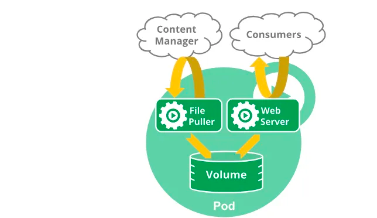
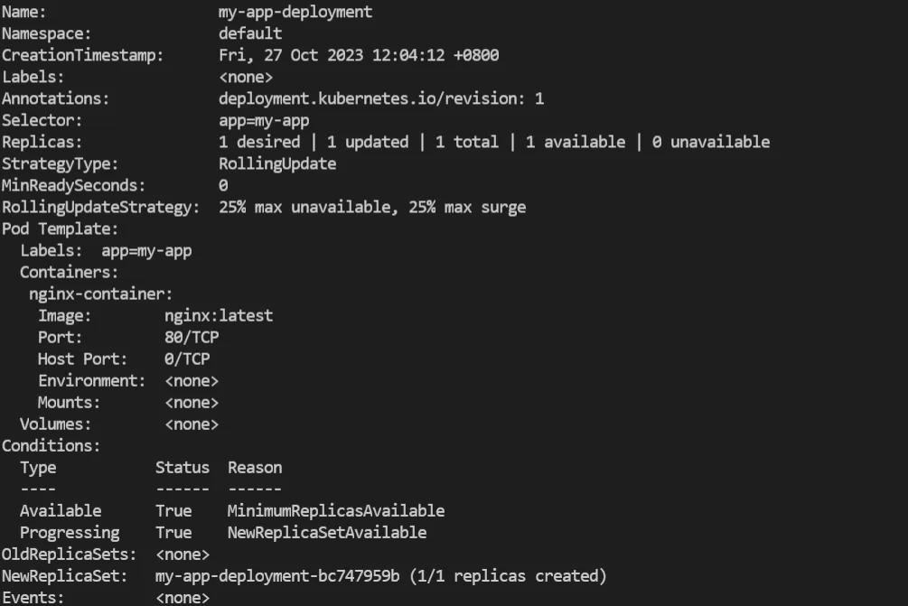
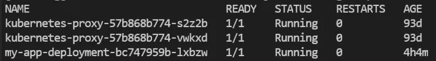
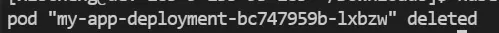
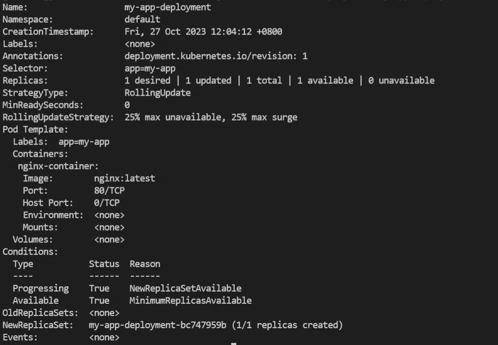
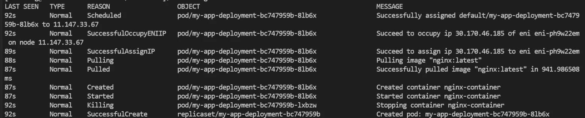

## 前言：Pod的生命周期概述

`pod`遵循一个既定的生命周期，在起始的时候，它会是`Pending`状态，然后如果有一个主容器运行成功，那么就进入`Running`状态，之后取决于有没有容器失败，如果有失败的话则进入`Failed`状态，否则则是`Succeeded`状态。

当`Pod`状态为运行态的时候，`kubelet`仍然能够重启容器去处理错误。在K8S API层面，`Pod`也和其他对象一样，拥有一个期望状态和一个实际状态，`Pod`在它的生命周期内只会被调度一次，一旦`Pod`被调度到了某个节点，这个`Pod`就会一直在这个结点上运行，直到它被暂停或者结束。

在[前文Pod详解（一）中](https://juejin.cn/post/7294880695397859343)我们说过，`Pod`在k8s内部其实不是一个稳定的对象，**而是一个相对暂时态并且不稳定的对象**，`Pod`是被更上层的封装，即`workload resource`（老版本也叫`controller`）所控制的，而这个上层的封装在K8S中才是一个能够自我调控以达到稳定存在状态的对象。

在`Pod`被删除重建、或者失效的时候，`workload resource`会建立一个**全新的**`pod`，也就是`name`不同，`uid`也不同的`Pod`来代替这个`Pod`。

**不知道大家有没有考虑过一个问题：既然Name已经能够唯一标识Pod，那么为什么Pod里还需要引入UID这个字段呢？**

在K8S中对象的命名规则是这样的：**子对象名字=父对象名字+随机字符串。**

如果一个`Pod`被高级`workload`资源重建之后，会有一个新的名称（随机字符串）发生改变，以进行唯一性标识，但是`Pod Name`的唯一性只是命名空间级别的，对于整个集群来说并不唯一，所以引入了`UID`来作为集群内部的唯一标识。

同时，如果有和这个`Pod`生命周期相同的关联物，比如一个`volume`，它也会被销毁、重建。

我们可以简单的把Pod的状态分为两个部分，分别是阶段`Phase`和状态`Conditions`，前者是对`Pod`的高级概述，用来粗略的表示`Pod`在生命周期中的当前阶段；后者是一个更加详细和高级的状态，包含一个数组，每个元素都有一个`Type`和`Status`字段来提供更加详细的信息。



## 实战：重启Pod

下面让我们来试试：现在我有一个只有一个`pod`的`deployment`，我们来销毁这个pod会发生什么。

我们通过`kubectl`来显示这个`deployment`的详情信息，同样是[前文Pod详解（一）中](https://juejin.cn/post/7294880695397859343)我们创建的那个非常简单的`deployment`。



然后查看当前命名空间下的所有`pod`，再手动删掉我们当前被`deployment`所管理的这个pod。





再次查看`deployment`的具体信息，以及当前命名空间下的所有事件，会发现原来的`pod`已经被删除了，并且重新建立了一个相同配置的`pod`实例，但是名字已经发生改变。





通过K8S事件，我们能很清楚的看到具体`Pod`销毁重建的过程如下:

-   停止原有的容器，删掉`Pod`。
-   创建新`Pod`，拉取镜像创建容器。
-   给新的`Pod`分配资源，如`IP`地址等。

## Pod Phase

### 概述

这个字段标识着Pod的当前状态，一共有`Pending、Running、Succeeded、Failed、Unknown`五个值，它是对`Pod`所在生命周期中位置的**简单宏观描述**，我们可以通过`status.phase`字段来观察到现在`pod`的状态是什么样子的。

下面是对[K8S官方文档](https://kubernetes.io/docs/concepts/workloads/pods/pod-lifecycle/#pod-phase)的引用，详细解释了这五个值的描述以及什么时候会出现。

| Value     | Description                                                    |
| --------- | -------------------------------------------------------------- |
| Pending   | Pod已经被K8S系统接受，但有一个或者多个容器尚未创建亦未运行。此阶段包括等待Pod被调度的时间和通过网络下载镜像的时间。 |
| Running   | Pod已经绑定到了某个节点，Pod中所有的容器都已经被创建。至少有一个容器仍在运行，或者正处于启动或重启状态。        |
| Succeeded | Pod中的所有容器都已成功终止，并且不会再重启。                                       |
| Failed    | Pod中的所有容器都已终止，并且至少有一个容器是因为失败终止。也就是说，容器以非0状态退出或者被系统终止。          |
| Unknown   | 因为某些原因无法取得Pod的状态，这种情况通常是因为与Pod所在的主机通信失败。                       |

当然，除了上面的状态之外，Pod可能还有一个短暂的`Terminating`状态用来表示**这个**`Pod`**正在结束中**，只有在`Pod`优雅结束的时候才会显示这个状态，我们有时候通过`kubectl`能够得到这个状态，一般在一段时间之后，30S之后这个状态就会流转为其他状态。

如果集群中有某个节点死掉或者失联，那么K8S集群会将失去的节点上运行的所有`Pod`的状态设置为`Failed`。

### 源码

下面让我们来看看`PodPhase`的源码。

```
// PodPhase is a label for the condition of a pod at the current time.
type PodPhase string

// These are the valid statuses of pods.
const (
	// PodPending means the pod has been accepted by the system, but one or more of the containers
	// has not been started. This includes time before being bound to a node, as well as time spent
	// pulling images onto the host.
	PodPending PodPhase = "Pending"
	// PodRunning means the pod has been bound to a node and all of the containers have been started.
	// At least one container is still running or is in the process of being restarted.
	PodRunning PodPhase = "Running"
	// PodSucceeded means that all containers in the pod have voluntarily terminated
	// with a container exit code of 0, and the system is not going to restart any of these containers.
	PodSucceeded PodPhase = "Succeeded"
	// PodFailed means that all containers in the pod have terminated, and at least one container has
	// terminated in a failure (exited with a non-zero exit code or was stopped by the system).
	PodFailed PodPhase = "Failed"
	// PodUnknown means that for some reason the state of the pod could not be obtained, typically due
	// to an error in communicating with the host of the pod.
	PodUnknown PodPhase = "Unknown"
)
```

能看出来`PodPhase`其实就是字符串类型的别名，并且和文档上描述的一样，这个类型只有五个值，有点类似于自动机的思想，字段的值会在这五个值之间进行流转。

## Pod Conditions

### 概述

`Pod Conditions`**能够表示更加详细的**`Pod`**状态**，每个`Pod`都会有一个`Conditions`**数组**，这个数组中的每个元素都会有`type`和`status`两个字段，以及一些其他的控制信息，能看出来这个状态带上了时间，信息等详细状态，这也刚好作为`Pod phase`过于粗略、无法展示详细状态信息的补充。

同时，一个`Pod`拥有一个`Conditions`数组，而不是单独的`Conditions`字段能够方便跟踪和记录`Pod`的状态和实践的历史，以便更好地监控和诊断`Pod`的行为，并且一个`Pod`可能同时处于不同的条件状态下，方便表示当前的具体状态。

每个`Condition`由以下五部分组成，翻译自[K8S官方文档](https://kubernetes.io/docs/concepts/workloads/pods/pod-lifecycle/#pod-conditions)。

| Field name         | Description                                 |
| ------------------ | ------------------------------------------- |
| type               | Pod 条件的Name                                 |
| status             | 标识这个Condition的状态，值可能为True False或者Unkown中的一个 |
| lastProbeTime      | 上次探测Pod Condition的时间戳                       |
| lastTransitionTime | 上次Pod从一个状态流转至另一个状态的时间                       |
| reason             | 上一次状态流转的原因                                  |
| message            | 上一次状态流转蕴含的信息                                |

### 源码

```
type PodCondition struct {
	// Type is the type of the condition.
	// More info: https://kubernetes.io/docs/concepts/workloads/pods/pod-lifecycle#pod-conditions
	Type PodConditionType `json:"type" protobuf:"bytes,1,opt,name=type,casttype=PodConditionType"`
	// Status is the status of the condition.
	// Can be True, False, Unknown.
	// More info: https://kubernetes.io/docs/concepts/workloads/pods/pod-lifecycle#pod-conditions
	Status ConditionStatus `json:"status" protobuf:"bytes,2,opt,name=status,casttype=ConditionStatus"`
	// Last time we probed the condition.
	// +optional
	LastProbeTime metav1.Time `json:"lastProbeTime,omitempty" protobuf:"bytes,3,opt,name=lastProbeTime"`
	// Last time the condition transitioned from one status to another.
	// +optional
	LastTransitionTime metav1.Time `json:"lastTransitionTime,omitempty" protobuf:"bytes,4,opt,name=lastTransitionTime"`
	// Unique, one-word, CamelCase reason for the condition's last transition.
	// +optional
	Reason string `json:"reason,omitempty" protobuf:"bytes,5,opt,name=reason"`
	// Human-readable message indicating details about last transition.
	// +optional
	Message string `json:"message,omitempty" protobuf:"bytes,6,opt,name=message"`
}
```

首先我们能看到`PodCondition`由两个结构体，两个时间戳和两个`String`组成，时间戳和String代表的含义很容易看出来，通过变量名我们就能理解含义，所以主要讲解`PodConditionType`和`ConditionStatus`这两个结构体复合字段。

**PodConditionType**

```
// PodConditionType is a valid value for PodCondition.Type
type PodConditionType string

// These are valid conditions of pod.

const (
	// ContainersReady indicates whether all containers in the pod are ready.
	ContainersReady PodConditionType = "ContainersReady"
	// PodInitialized means that all init containers in the pod have started successfully.
	PodInitialized PodConditionType = "Initialized"
	// PodReady means the pod is able to service requests and should be added to the
	// load balancing pools of all matching services.
	PodReady PodConditionType = "Ready"
	// PodScheduled represents status of the scheduling process for this pod.
	PodScheduled PodConditionType = "PodScheduled"
)
```

`PodConditionType`的状态也是字符串类型的别名，但是它的值和`Phase`字段的几个值相比，更加偏向于具体状态，分别有`ContainersReady\PodInitialized\PodReady\PodScheduled`几个值，它们的具体含义如下

-   ContainerReady：所有容器是否全为就绪状态
-   PodInitialized：所有初始化容器是否已经成功启动
-   PodReady：Pod是否能够已经准备好接受流量，能够正常处理请求
-   PodScheduled：Pod是否已经被调度到某个节点上

**ConditionStatus**

```
type ConditionStatus string

// These are valid condition statuses. "ConditionTrue" means a resource is in the condition.
// "ConditionFalse" means a resource is not in the condition. "ConditionUnknown" means kubernetes
// can't decide if a resource is in the condition or not. In the future, we could add other
// intermediate conditions, e.g. ConditionDegraded.
const (
	ConditionTrue    ConditionStatus = "True"
	ConditionFalse   ConditionStatus = "False"
	ConditionUnknown ConditionStatus = "Unknown"
)
```

这个值主要是和条件`PodConditionType`进行关联，用来指定当前`Pod`有没有满足这个状态，如果满足则为真，否则为假，当特殊情况时，比如`Pod`网络和集群无法联通，那么可能会出现`Unknown`状态。

## 结语

今天这篇博客主要从`Go`源码方面向大家剖析`Pod`生命周期相关的两个字段`Phase`和`Conditions`，并介绍了它们的区别和具体作用。

《每天十分钟，轻松入门K8S》的第五篇**05.源码级别Pod详解（二）** 到这里就结束了，感谢您看到这里。

之后的几讲都会和`Pod`相关，深入源码级别探索K8S核心概念`Pod`相关内容，感兴趣的小伙伴欢迎点赞、评论、收藏，您的支持就是对我最大的鼓励。
