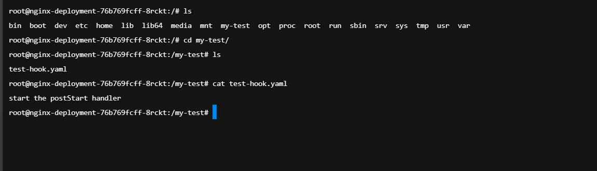
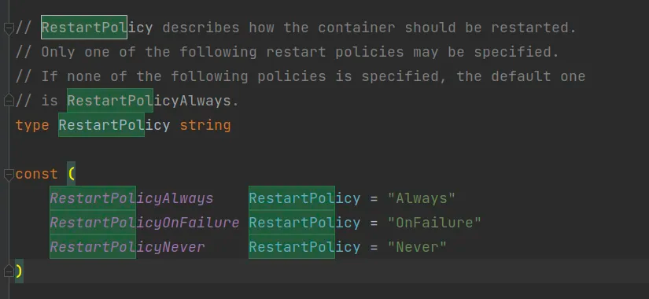

## 前言

K8S除了会全生命周期跟踪`Pod`的状况，还会跟踪更底层的`Container`生命周期，`Container`的生命周期主要是由三部分组成、调控的，分别是`Container States`、`postStart&&preStop`以及`Container RestartPolicy`。

`Container States`是一个类似于`Phase`一样的，对于`Container`当前状态的简单描述。

`postStart`和`preStop`则是容器预留的两个钩子，分别用来在容器启动之后和容器终止之前进行某些特定操作。

`Container RestartPolicy`则是在容器失败的时候会使用到的重启策略，规定了容器什么情况才会重启。

## Container States

### 概述

就像K8S会全生命周期跟踪`Pod`的状况，并且用`Phase`字段进行描述一样。

K8S也会追踪`Pod`中每个容器的状态，一旦`Pod`被`Schduler`调度分配到某个`Node`上，这个`Node`上的`kubelet`就会使用`container runtime`运行时类来创建对应的`containers`。

`container states`也有三个值，对应着三个不同的状态，分别是`waiting`、`runnning`、`terminated`

-   **waiting**：当容器的状态不是`running`或者`terminated`的时候，就为这个状态，它会不断执行启动需要的操作，比如拉取镜像，加载数据等等。当你使用`kubectl`查询`container`的时候，你也会得到一个`reason`字段，用来解释当前`container`处于此状态的原因。
-   **running**：正在正常运行中，如果配置了`postStart`钩子，那么会先去执行这个钩子函数，再启动容器。
-   **terminated**：正常结束或者因为某种原因失败，同样的，可以看到一些信息，如果配置了`preStop`钩子，那么会先执行这个钩子，再结束容器。

### 源码

```
// ContainerStatus contains details for the current status of this container.
type ContainerStatus struct {
	// This must be a DNS_LABEL. Each container in a pod must have a unique name.
	// Cannot be updated.
	Name string `json:"name" protobuf:"bytes,1,opt,name=name"`
	// Details about the container's current condition.
	// +optional
	State ContainerState `json:"state,omitempty" protobuf:"bytes,2,opt,name=state"`
	// Details about the container's last termination condition.
	// +optional
	LastTerminationState ContainerState `json:"lastState,omitempty" protobuf:"bytes,3,opt,name=lastState"`
	// Specifies whether the container has passed its readiness probe.
	Ready bool `json:"ready" protobuf:"varint,4,opt,name=ready"`
	// The number of times the container has been restarted, currently based on
	// the number of dead containers that have not yet been removed.
	// Note that this is calculated from dead containers. But those containers are subject to
	// garbage collection. This value will get capped at 5 by GC.
	RestartCount int32 `json:"restartCount" protobuf:"varint,5,opt,name=restartCount"`
	// The image the container is running.
	// More info: https://kubernetes.io/docs/concepts/containers/images
	// TODO(dchen1107): Which image the container is running with?
	Image string `json:"image" protobuf:"bytes,6,opt,name=image"`
	// ImageID of the container's image.
	ImageID string `json:"imageID" protobuf:"bytes,7,opt,name=imageID"`
	// Container's ID in the format 'docker://<container_id>'.
	// +optional
	ContainerID string `json:"containerID,omitempty" protobuf:"bytes,8,opt,name=containerID"`
	// Specifies whether the container has passed its startup probe.
	// Initialized as false, becomes true after startupProbe is considered successful.
	// Resets to false when the container is restarted, or if kubelet loses state temporarily.
	// Is always true when no startupProbe is defined.
	// +optional
	Started *bool `json:"started,omitempty" protobuf:"varint,9,opt,name=started"`
}
```

能看出来我们能获取ContainerStatus的属性如上：**包括ContainerName、当前状态、上次结束的状态、是否就绪、重启次数、镜像、镜像ID、ContainerID、是否启动等信息**。

其中`Started`这个字段非常巧妙，用了一个指针来表示，这样我们通过这个字段是否为`Nil`就知道属性是没有创建过（字段为`Nil`），还是单纯的没有启动（字段不为`Nil`，字段指向的值为`False`），这个看就绪字段`Ready`是看不出来的，因为它只是一个`Bool`值，不赋值的时候默认为`False`，无法区分到底是没有就绪，还是字段没有赋值。

**不知道大家有没有一个问题，即ContainerName已经是唯一的了，因为在Pod中不允许Container名字重复，也就是Name已经可以作为Container的唯一标识了，那么为什么还需要ContainerID这个字段呢？**

这是因为，`ContainerID`才是一个容器实例的唯一标识，`ContainerName`并不能作为唯一标识。为什么这么说呢？这是因为在容器重启的时候，其实是建立一个新的容器，这个时候它的名字并不会变，但是ID是会变的。

也就是说，`ContainerName`是一个`Pod`中某容器的唯一标识，而`ContainerID`是一个容器实例的唯一标识。

注意，这和`PodName`以及`PodUID`的区别是不一样的，我们在[Pod详解（二）](https://juejin.cn/post/7295565904406511657)中提到过，如果一个Pod被高级workload资源重建之后，会有一个新的名称（随机字符串）发生改变，以进行唯一性标识，但是Pod Name的唯一性只是命名空间级别的，对于整个集群来说并不唯一，所以引入了UID来作为集群内部的唯一标识。

我们再深入看看具体容器状态能有哪些，能看出来表示容器状态的`ContainerStatus`的`State`字段和`LastTerminationState`字段，是一个结构体复合字段，这个结构体为`ContainerState`。其他的字段都是简单的`String`、`Bool`等字段，通过字段名字就能容易能看出来它们的含义和作用。

`State`和`LastTerminationState`这两个字段主要表示的是**当前处于什么状态，还有上次结束的时候是处于什么状态**，可能是正常退出，也有可能是还在`running`的时候就被强制退出了。

**下面是**`ContainerState`**的定义**，由三个字段组成，表示当前的状态具体是三种可能态中的哪一种。

```
type ContainerState struct {
	// Details about a waiting container
	// +optional
	Waiting *ContainerStateWaiting `json:"waiting,omitempty" protobuf:"bytes,1,opt,name=waiting"`
	// Details about a running container
	// +optional
	Running *ContainerStateRunning `json:"running,omitempty" protobuf:"bytes,2,opt,name=running"`
	// Details about a terminated container
	// +optional
	Terminated *ContainerStateTerminated `json:"terminated,omitempty" protobuf:"bytes,3,opt,name=terminated"`
}
```

上面是`ContainerState`结构体的定义，能看出来和上文讲述的三种状态是一一对应的，同时这些字段也是指针类型的，就能简单通过指针的值来判断到底是没赋值还是字段为空。

**Running状态**

```
type ContainerStateRunning struct {
	// Time at which the container was last (re-)started
	// +optional
	StartedAt metav1.Time `json:"startedAt,omitempty" protobuf:"bytes,1,opt,name=startedAt"`
}
```

只有一个字段用来记录启动时间，这也是为什么我们使用`kubectl`获取容器状态的时候，如果为`running`态，容器只会展示启动时间

**Waiting状态**

```
type ContainerStateWaiting struct {
	// (brief) reason the container is not yet running.
	// +optional
	Reason string `json:"reason,omitempty" protobuf:"bytes,1,opt,name=reason"`
	// Message regarding why the container is not yet running.
	// +optional
	Message string `json:"message,omitempty" protobuf:"bytes,2,opt,name=message"`
}
```

`Waiting`状态由两个字段构成，当前展示的信息和造成`Waiting`状态的原因。

**Terminated状态**

```
type ContainerStateTerminated struct {
	// Exit status from the last termination of the container
	ExitCode int32 `json:"exitCode" protobuf:"varint,1,opt,name=exitCode"`
	// Signal from the last termination of the container
	// +optional
	Signal int32 `json:"signal,omitempty" protobuf:"varint,2,opt,name=signal"`
	// (brief) reason from the last termination of the container
	// +optional
	Reason string `json:"reason,omitempty" protobuf:"bytes,3,opt,name=reason"`
	// Message regarding the last termination of the container
	// +optional
	Message string `json:"message,omitempty" protobuf:"bytes,4,opt,name=message"`
	// Time at which previous execution of the container started
	// +optional
	StartedAt metav1.Time `json:"startedAt,omitempty" protobuf:"bytes,5,opt,name=startedAt"`
	// Time at which the container last terminated
	// +optional
	FinishedAt metav1.Time `json:"finishedAt,omitempty" protobuf:"bytes,6,opt,name=finishedAt"`
	// Container's ID in the format 'docker://<container_id>'
	// +optional
	ContainerID string `json:"containerID,omitempty" protobuf:"bytes,7,opt,name=containerID"`
}
```

`Terminated`状态就会展示很多信息，从上面的代码能看出来，包括退出状态码、上一次的信号、信息及相关原因、容器启动时间、容器结束时间、容器`ID`等等。

这也是很符合逻辑的，我们一般往深入查看容器上次退出的状态，比如是正常退出（退出码为0）还是异常退出等等。

## postStart和preStop

### 概述

这两个都是容器生命周期时间暴露出来的钩子函数，我们可以进行配置对应的`hook`，来确保在容器启动后和停止执行之前执行一些特定的操作。

-   postStart：在容器启动之后立即触发，然而它并不能保证在容器`ENTRYPOINT`或者`COMMAND`之前触发。通常用来执行一些需要在应用程序启动之后立即执行的操作，例如检查或者修改状态，发送某些事件等。
-   preStop：在容器终止之前触发，它是一个优雅关闭的机会，可以用来清理资源，发送通知、保存状态等。K8S会在`preStop`钩子完成后等待一段时间，具体时间由`terminationGracePeriodSeconds`这个字段指定，然后发送`SIGTERM`信号来终止容器。如果容器已经处于已终结或者已完成状态，则对`preStop`回调的调用将失败，在用来停止容器的`TERM`信号被发出之前，回调必须执行结束。如果超时仍未结束，则会直接退出容器。

`ENTRYPOINT`：这个指令定义了容器启动时要运行的可执行文件，可以把它看做是容器的主命令，常用于启动容器。

`COMMAND`：这个指令定义了传递给ENTRYPOINT的默认参数，如果在运行容器的时候提供了额外的参数，那么这些参数会替换COMMAND中的参数。

针对容器，有两种类型的回调程序可以实现：

-   Exec：容器内部执行的命令
-   HTTP：K8S系统执行，通过`httpGet`和`tcpSocket`在`kubelet`进程执行

这两种事件都可以执行一个命令或者发送一个HTTP请求，如果钩子函数失败了，比如说命令的返回值非0，或者HTTP请求失败，容器则会被杀死。

**钩子函数的本质就是提供一个更定制化的、控制容器生命周期的方法，以适应应用程序的需求**。

### 栗子

下面的这个`deployment`会部署三个`Pod`，每个`Pod`会有一个名为`nginx`的`container`，我们在`lifecycle`中添加`postStart`和`preStop`两个钩子函数。这两个钩子都是以`exec`的方式运作的，也就是内部的容器命令，其中`preStop`不太好观察，因为执行完之后容器就重启了。

我们来观察一下`postStart`的效果。

```
apiVersion: apps/v1
kind: Deployment
metadata:
  name: nginx-deployment
spec:
  replicas: 3
  selector:
    matchLabels:
      app: nginx
  template:
    metadata:
      labels:
        app: nginx
    spec:
      containers:
      - name: nginx
        image: nginx:1.14.2
        ports:
        - containerPort: 80
        lifecycle:
          postStart:
            exec:
              command: ["/bin/sh", "-c", "mkdir -p /my-test && echo start the postStart handler > /my-test/test-hook.yaml"]
          preStop:
            exec:
              command: ["/bin/sh", "-c", "echo stop the preStop handler > /data/home/xischeng/test-hook.yaml "]
```

通过`kubectl apply -f`上述文件，创建一个`deployment`对象。

对象创建成功之后进入容器内部，会发现`postStart`函数已经执行完成，在对应文件中写入相关内容。


### 源码

通过下面的代码我们能看出来，两个钩子函数都是同一个类型，即`*Handler`。下面让我们看看这个结构体里面具体有什么。

```
type Lifecycle struct {
	// PostStart is called immediately after a container is created. If the handler fails,
	// the container is terminated and restarted according to its restart policy.
	// Other management of the container blocks until the hook completes.
	// More info: https://kubernetes.io/docs/concepts/containers/container-lifecycle-hooks/#container-hooks
	// +optional
	PostStart *Handler `json:"postStart,omitempty" protobuf:"bytes,1,opt,name=postStart"`
	// PreStop is called immediately before a container is terminated due to an
	// API request or management event such as liveness/startup probe failure,
	// preemption, resource contention, etc. The handler is not called if the
	// container crashes or exits. The reason for termination is passed to the
	// handler. The Pod's termination grace period countdown begins before the
	// PreStop hooked is executed. Regardless of the outcome of the handler, the
	// container will eventually terminate within the Pod's termination grace
	// period. Other management of the container blocks until the hook completes
	// or until the termination grace period is reached.
	// More info: https://kubernetes.io/docs/concepts/containers/container-lifecycle-hooks/#container-hooks
	// +optional
	PreStop *Handler `json:"preStop,omitempty" protobuf:"bytes,2,opt,name=preStop"`
}
```

其实这是对三个结构体的封装，对应着三种钩子函数的实现方式，前面我们都有介绍过这三种的区别。

```
type Handler struct {
	// One and only one of the following should be specified.
	// Exec specifies the action to take.
	// +optional
	Exec *ExecAction `json:"exec,omitempty" protobuf:"bytes,1,opt,name=exec"`
	// HTTPGet specifies the http request to perform.
	// +optional
	HTTPGet *HTTPGetAction `json:"httpGet,omitempty" protobuf:"bytes,2,opt,name=httpGet"`
	// TCPSocket specifies an action involving a TCP port.
	// TCP hooks not yet supported
	// TODO: implement a realistic TCP lifecycle hook
	// +optional
	TCPSocket *TCPSocketAction `json:"tcpSocket,omitempty" protobuf:"bytes,3,opt,name=tcpSocket"`
}
```

****

****

**Exec**

```
type ExecAction struct {
	// Command is the command line to execute inside the container, the working directory for the
	// command  is root ('/') in the container's filesystem. The command is simply exec'd, it is
	// not run inside a shell, so traditional shell instructions ('|', etc) won't work. To use
	// a shell, you need to explicitly call out to that shell.
	// Exit status of 0 is treated as live/healthy and non-zero is unhealthy.
	// +optional
	Command []string `json:"command,omitempty" protobuf:"bytes,1,rep,name=command"`
}
```

容器内部执行的命令就是简单的`shell`命令，所以通过`[] string`来存储命令集合即可。

****

**HTTP**

```
type HTTPGetAction struct {
	// Path to access on the HTTP server.
	// +optional
	Path string `json:"path,omitempty" protobuf:"bytes,1,opt,name=path"`
	// Name or number of the port to access on the container.
	// Number must be in the range 1 to 65535.
	// Name must be an IANA_SVC_NAME.
	Port intstr.IntOrString `json:"port" protobuf:"bytes,2,opt,name=port"`
	// Host name to connect to, defaults to the pod IP. You probably want to set
	// "Host" in httpHeaders instead.
	// +optional
	Host string `json:"host,omitempty" protobuf:"bytes,3,opt,name=host"`
	// Scheme to use for connecting to the host.
	// Defaults to HTTP.
	// +optional
	Scheme URIScheme `json:"scheme,omitempty" protobuf:"bytes,4,opt,name=scheme,casttype=URIScheme"`
	// Custom headers to set in the request. HTTP allows repeated headers.
	// +optional
	HTTPHeaders []HTTPHeader `json:"httpHeaders,omitempty" protobuf:"bytes,5,rep,name=httpHeaders"`
}
```

写过`Web`程序的同学应该都很熟悉，上面这些字段能够构成一个`HTTP`请求格式。

****

**TCP**

```
type TCPSocketAction struct {
	// Number or name of the port to access on the container.
	// Number must be in the range 1 to 65535.
	// Name must be an IANA_SVC_NAME.
	Port intstr.IntOrString `json:"port" protobuf:"bytes,1,opt,name=port"`
	// Optional: Host name to connect to, defaults to the pod IP.
	// +optional
	Host string `json:"host,omitempty" protobuf:"bytes,2,opt,name=host"`
}
```

`Socket`编程比较简单，通过`IP`和`Port`就能够完成连接的建立。

## Container RestartPolicy

### 概述

容器重启策略有三种，定义在`spec.restartPolicy`字段中，即`Always` `OnFailure` `Never`三种，默认的值是`Always`，`restartPolicy`是`PodSpec`的一个字段，也就是说重启策略是以`Pod`为单位的，会对pod中的所有`container`生效。

-   Always: 如果容器失败或终止，将始终重启容器，这是默认行为，通常用于关键的应用程序或者服务，以确保它们一直处于运行状态。
-   OnFailure: 仅在失败时重启，也就是说容器如果正常退出（退出码为0），它就不会自动重启，适用于一些不太关键的任务，当它们失败的时候才需要重启。
-   Never:容器永远不会自动重启，无论它是正常终止还是失败，适用于一些一次性的任务或者容器。

### 源码



一共有三个固定字符串的值，用来表示我们上述介绍的三个状态。

## 结语

今天这篇博客主要从`Go`源码方面和容器`hook`函数使用方面，向大家剖析`Container`生命周期相关的三个字段，即`States`、`Hook`和`RestartPolicy`。

《每天十分钟，轻松入门K8S》的第六篇**06.源码级别Pod详解（三）** 到这里就结束了，感谢您看到这里。

之后的几讲都会和`Pod`相关，深入源码级别探索K8S核心概念`Pod`相关内容，感兴趣的小伙伴欢迎点赞、评论、收藏，您的支持就是对我最大的鼓励。
