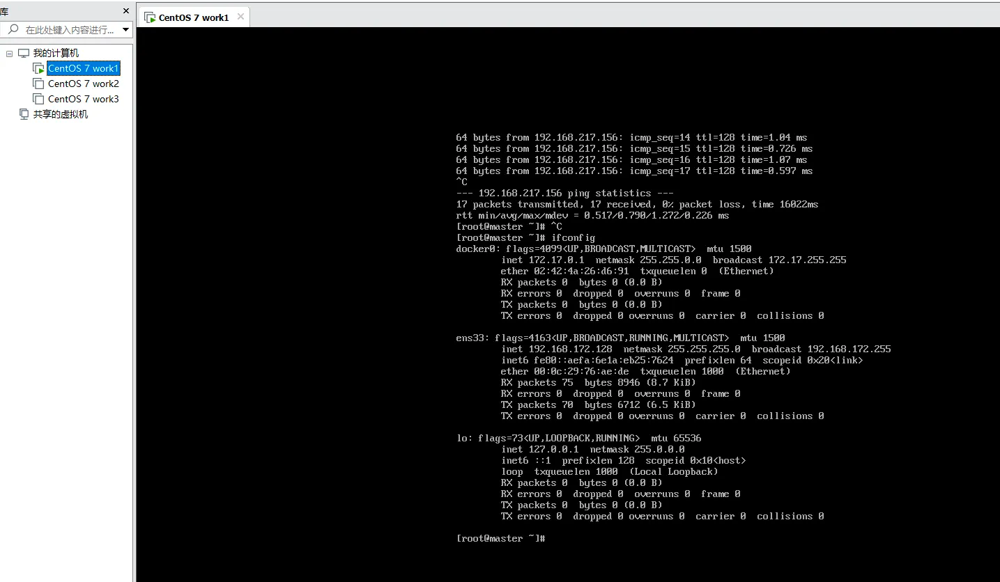
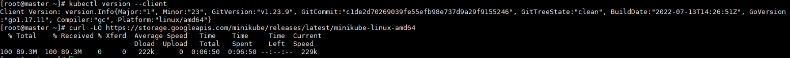
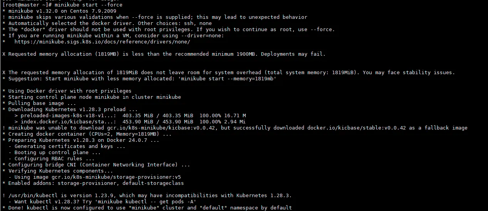
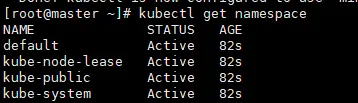

## 前言

你需要一台`Linux`操作系统的虚拟机，服务器也可以，不过这个需要花点钱，新人优惠的话阿里云服务器第一年不到一百元，还是比较良心的。

在搭建K8S学习环境之前还需要安装`Docker`，网上有一键安装的脚本，我们也可以通过包管理进行安装，这里不再赘述。

## 安装

因为仅用于学习，我们只搭建最简单的单节点环境，想要成功安装单点K8S集群，需要安装`kubectl`和`minikube`两个工具。

### kubectl

`kubectl`是K8S的命令行工具，也是我们日常操作K8S的入口，另一种操作K8S的方式就是通过`K8S-Client`提供的`API`，这两种方式本质都是一样的。

`kubectl`的安装可以参考[这里](https://kubernetes.io/zh-cn/docs/tasks/tools/install-kubectl-linux/)，通过包管理工具可以很轻松的进行安装，这里就不多做赘述。

最后我们可以通过`kubectl version --client`命令来验证安装是否成功。

### minikube

`minikube`是一个能让我们在本地运行K8S的工具，我们用它来搭建单节点集群。

`minikube`的安装可以参考[这里](https://kubernetes.io/zh-cn/docs/tasks/tools/#minikube)，我们通过官方提供的`minikube`工具来实现学习环境的简单安装。

因为需要在谷歌下载对应的发行版，所以速度可能会比较慢。

按照教程安装之后就可以通过`minikube start`来启动minikube了，我这里因为docker给了管理员权限，可能会有部分风险，所以加上`-- force`标签强制运行。

成功启动之后我们通过`kubectl get namespace`来验证是否安装成功，像下面这样就是成功了。

## 结语

上述过程在两分钟内轻松安装了一个单节点K8S集群用于学习，感兴趣的小伙伴欢迎**点赞、评论、收藏**，您的支持就是对我最大的鼓励。
