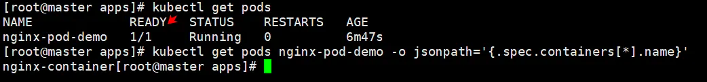
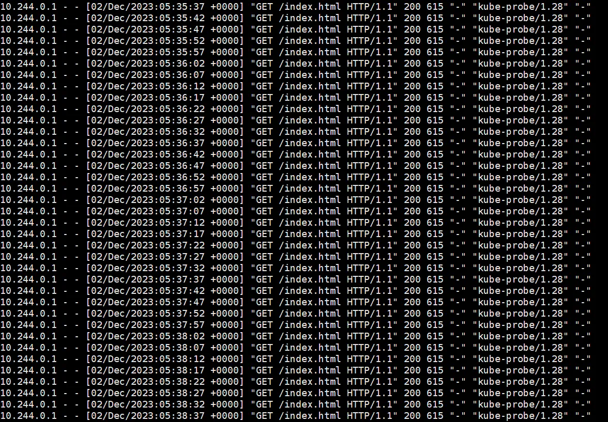
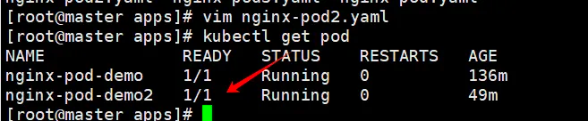
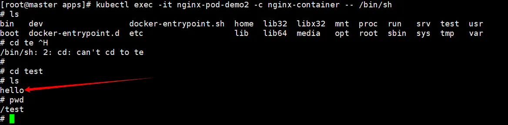

## 前言

在前文我们[05.源码级别Pod详解（二）：Pod生命周期](https://juejin.cn/post/7295565904406511657)说过，因为`Pod`通常不直接被部署，而是通过更高级别的`Workload`所进行调度和管控，于是K8S提供了一种检测`Pod`是否成功部署的机制，这就是`Pod readiness`。

## Pod readiness

本质上`Pod readiness`是向`PodStatus`注入额外信号的手段，我们可以在`PodSpec`中设置`readiness`，通过检测`Pod`是否满足我们设置的条件来判断`Pod`是否已经就绪。

最终`readiness`的值是由`PodStatus`的`condition`来决定的，我们在[05.源码级别Pod详解（二）：Pod生命周期](https://juejin.cn/post/7295565904406511657)讲述过`PodCondition`相关内容，如果`condition`的值为空或者为否，那么`readiness`也会是一个`False`的值。一个`Pod`被认为是`Ready`时，必须满足以下两个条件。

-   所有的容器都是`ready`状态
-   所有定义在`readinessGates`的值都是`true`

下面是`PodReadinessGate`的源码

```
// PodReadinessGate contains the reference to a pod condition
type PodReadinessGate struct {
	// ConditionType refers to a condition in the pod's condition list with matching type.
	ConditionType PodConditionType
}

// PodConditionType defines the condition of pod
type PodConditionType string

// These are valid conditions of pod.
const (
	// PodScheduled represents status of the scheduling process for this pod.
	PodScheduled PodConditionType = "PodScheduled"
	// PodReady means the pod is able to service requests and should be added to the
	// load balancing pools of all matching services.
	PodReady PodConditionType = "Ready"
	// PodInitialized means that all init containers in the pod have started successfully.
	PodInitialized PodConditionType = "Initialized"
	// PodReasonUnschedulable reason in PodScheduled PodCondition means that the scheduler
	// can't schedule the pod right now, for example due to insufficient resources in the cluster.
	PodReasonUnschedulable = "Unschedulable"
	// ContainersReady indicates whether all containers in the pod are ready.
	ContainersReady PodConditionType = "ContainersReady"
)
```

如果`Pod`类型为`Ready`的`Condition`的值为`True`，那么就表示`Pod`就绪。也可以通过探针的方式来检测`Pod`是否就绪，用户可以定义`Readiness Probe`，通过设置探测条件来确定`Pod`是否已经就绪。

就绪的定义是：`Pod`已经成功运行，可以接受外来流量。

k8s不允许手动操作**任何K8S对象**的`status`字段，所有对象的`status`这个字段都是只读的。

### Pod Network Readiness (v1.25)【alpha】

k8s在`v1.25`版本中，引入了一个新的特性，即`Pod Network Readiness`。这个功能仍然处于早期阶段（alhpa），所以我们仅做一些简单的了解。

当`Pod`被调度到`node`之后，它会被上报到`kubelet`和控制平面。当这些步骤都完成之后，`kubelet`会通过`CRI`来创建`Pod`运行时的沙箱环境（沙箱指的是受限制的环境，因为`Pod`运行的程序不一定是安全的，所以沙箱可以隔离风险，程序中的恶意代码影响会被限制在沙箱内而不会影响到系统的其他部分。）

当`kubelet`检测到`Pod`没有配置网络设置运行时沙箱，那么`PodReadyToStartContainers`就会被设置为`false`，这会在以下情况中出现

-   在`pod`生命周期的早期（刚建立），`kubelet`还没来得及设置pod的沙箱环境
-   在`pod`生命周期之后的阶段，`Pod`的沙箱环境因为某些原因被摧毁。比如因为`Node`重启导致而`pod`没有被驱逐；或者底层使用的是虚拟机，当虚拟机重启之后，需要创建新的沙箱和新的网络配置。

当`kubelet`成功将沙箱环境创建好，并将网络配置成功之后，`PodReadyToStartContainers`字段就会被设置为`True`。在当这个值为`True`之后，`kubelet`可以开始拉取镜像，并且创建容器。当一个`Pod`有`init containers`字段时，那么`kubelet`会在这些容器都成功启动之后才把`Initialized`字段设为`True`；如果没有这个字段，那么在沙箱环境设置成功之前就会将`Initialized`设置为`True`。

### Pod scheduling readiness (v1.27) [beta]

[Pod调度就绪](https://kubernetes.io/docs/concepts/scheduling-eviction/pod-scheduling-readiness/)，这个特性在1.27版本才引入，想要了解的读者可以查看原文链接，这里不多做赘述。

## Container Probe

探针（`probe`）本质上是`kubelet`对于容器的周期性执行的一个工具，它有两种实现的形式，要么是进行一些网络上的连接测试，要么是执行容器内部的某些命令。`probe`通常的作用是检测容器内的服务是否处于健康状态，或者是否已经成功启动，可以接受流量。

探针的输出有三种，分别是`success`、`failure`和`unknown`。

### 三种探针

同时，根据不同的目的和探测时间，我们又把`Probe`分成了下列三种

`livenessProbe`：检测容器是否存活，如果检测失败，那么`kubelet`会将容器杀死，然后根据容器策略进行重启。当容器不能够在遇到问题，或者服务不健康的时候自动崩溃，那么就需要使用这个探针，保证服务一旦出问题就立马重启容器。

`readinessProbe`：检测容器是否就绪，从而确定容器是否具有接受流量的能力。容器检测失败，那么`endpoint controller`会将这个`Pod IP`从`Service`中删掉，流量便不会打到这个`Pod`上。如果想要在确定无误的时候才接入流量，而不是`Pod`一启动就接入流量，那么就需要使用这个探针。`readinessProbe`和`livenessProbe`可能同时存在，但是只有在`readinessProbe`探测成功之后才会接入流量。

`startupProbe`：和`livenessProbe`有点类似，它检测容器内的服务是否成功启动，如果检测失败，就会将容器杀死，然后根据容器策略进行重启。对于需要较长时间才能启动的服务，通常可以设置这种探针以便于容器成功启动。

### 四类实现

我们通过探针具体实现检测的方式，将它们分成下列四种

`exec`：在容器内部执行命令，通过是否成功执行来检测是否处于预期状态。

`grpc`：在v1.24版本引入，执行一次远程过程调用，当结果是`SERVING`状态的时候则成功。

`httpGet`：发送请求`http`请求，具体地址为`PodIp+port(设置)/page(设置)`，当返回码为200到400之间成功。

`tcpSocket`：对`Pod`的`IP`进行一次`TCP`检查，如果端口正在监听中，则认为成功。

因为本质上只有执行命令和网络请求两种模式，上述我们讲述的也是`Pod Readiness`，下面来进行`Pod Readiness`类型`exec`和`httpGet`的实战演练，`tcpSocket`和`grpc`使用较少，感兴趣可以自行尝试，其实也只是进行简单的修改就可以了。

### httpGet Probe

下面是一个使用了`httpGet`的`Pod`，非常简单，注意`probe`是`container`级别的，所以要在`containers`字段中。

```
apiVersion: v1
kind: Pod
metadata:
  name: nginx-pod-demo
spec:
  containers:
  - name: nginx-container
    image: nginx:latest
    ports:
    - containerPort: 80
    readinessProbe:
      httpGet:
        path: /index.html
        port: 80
      // 初始化5秒之后进行检测 	
      initialDelaySeconds: 5
      // 每五秒检测一次
      periodSeconds: 5
```



我们通过`kubectl get pods podname -o jsonpath='.spec.containers[*].name'`这个命令确定`container`。

目前这个`Pod`只有一个`container`，我们很轻易的就知道这个`containername`是什么，当Pod有多个`container`的时候，可以通过上述命令轻松的将一个`pod`的所有`container`都拉出来。

然后通过下面这个命令

`kubectl logs nginx-pod-demo -c nginx-container`查看日志



能看出来访问`http://10.244.0.1:80/index.html` 这个`URL`的结果是`200`成功，处于`200-400`之间，`Probe`检测结果为`True`，所以`Pod`的状态变为了`Ready`。

上面`URL`的`IP`地址就是`Pod`的`Ip`地址，同时也是容器的`Ip`地址。

### exec Probe

```
apiVersion: v1
kind: Pod
metadata:
  name: nginx-pod-demo2
spec:
  containers:
  - name: nginx-container
    image: nginx:latest
    ports:
      - containerPort: 80
    readinessProbe:
      exec:
        command:
          - mkdir
          - -p
          - /test/hello
```

我们首先创建对应的`Pod`，再查看一下是否进入`Ready`状态。



`kubectl exec -it nginx-pod-demo -c nginx-container -- /bin/sh`

进入容器内部，发现确实创建了这个目录，验证成功。



### 容器初始化

`EntryPoint`和`CMD`都是用来指定容器初始化将要执行的命令的，但是他们有不同的规则

`EntryPoint`会把`docker run`命令的参数视作`EntryPoint`的参数，并且在容器启动的时候，作为主线程执行，通常`EntryPoint`定义着容器的默认行为。

```
dockerfile
ENTRYPOINT ["echo", "hello"]

如果我们docker run追加参数 像下面这样
docker run mycontainer World 
这样就会追加参数到entrypoint中，打印出hello World
```

`CMD`可以用来给`EntryPoint`指定参数，也可以单独使用，`CMD`以在运行容器时被覆盖掉

```
dockerfile 
CMD ["echo", "Hello World"]

如果我们docker run追加命令 像下面这样
docker run mycontainer echo Fucking World 
通过这样的方式就可以覆盖掉cmd的参数
```

## Probe源码解读

```
// Container represents a single container that is expected to be run on the host.
type Container struct {
	// Required: This must be a DNS_LABEL.  Each container in a pod must
	// have a unique name.
	Name string
	// Required.
	Image string
	// Optional: The docker image's entrypoint is used if this is not provided; cannot be updated.
	// Variable references $(VAR_NAME) are expanded using the container's environment.  If a variable
	// cannot be resolved, the reference in the input string will be unchanged.  The $(VAR_NAME) syntax
	// can be escaped with a double $$, ie: $$(VAR_NAME).  Escaped references will never be expanded,
	// regardless of whether the variable exists or not.
	// +optional
	Command []string
	// Optional: The docker image's cmd is used if this is not provided; cannot be updated.
	// Variable references $(VAR_NAME) are expanded using the container's environment.  If a variable
	// cannot be resolved, the reference in the input string will be unchanged.  The $(VAR_NAME) syntax
	// can be escaped with a double $$, ie: $$(VAR_NAME).  Escaped references will never be expanded,
	// regardless of whether the variable exists or not.
	// +optional
	Args []string
	// Optional: Defaults to Docker's default.
	// +optional
	WorkingDir string
	// +optional
	Ports []ContainerPort
	// List of sources to populate environment variables in the container.
	// The keys defined within a source must be a C_IDENTIFIER. All invalid keys
	// will be reported as an event when the container is starting. When a key exists in multiple
	// sources, the value associated with the last source will take precedence.
	// Values defined by an Env with a duplicate key will take precedence.
	// Cannot be updated.
	// +optional
	EnvFrom []EnvFromSource
	// +optional
	Env []EnvVar
	// Compute resource requirements.
	// +optional
	Resources ResourceRequirements
	// +optional
	VolumeMounts []VolumeMount
	// volumeDevices is the list of block devices to be used by the container.
	// +optional
	VolumeDevices []VolumeDevice
	// +optional
	LivenessProbe *Probe
	// +optional
	ReadinessProbe *Probe
	// +optional
	StartupProbe *Probe
	// +optional
	Lifecycle *Lifecycle
	// Required.
	// +optional
	TerminationMessagePath string
	// +optional
	TerminationMessagePolicy TerminationMessagePolicy
	// Required: Policy for pulling images for this container
	ImagePullPolicy PullPolicy
	// Optional: SecurityContext defines the security options the container should be run with.
	// If set, the fields of SecurityContext override the equivalent fields of PodSecurityContext.
	// +optional
	SecurityContext *SecurityContext

	// Variables for interactive containers, these have very specialized use-cases (e.g. debugging)
	// and shouldn't be used for general purpose containers.
	// +optional
	Stdin bool
	// +optional
	StdinOnce bool
	// +optional
	TTY bool
}
```

上述代码是K8S中对于`Container`的定义，能看出来每个`Container`都能定义我们上述提到的三种探针，同时还有一个`lifecycle`属性，这个也和容器的启动和终止有关，前文汇总我们已经详细介绍过了，[lifecycle详解](https://juejin.cn/post/7296303730772656162#heading-11)。

我们来看看对于`Probe`的定义

```
type Probe struct {
	// The action taken to determine the health of a container
	Handler
	// Length of time before health checking is activated.  In seconds.
	// +optional
	InitialDelaySeconds int32
	// Length of time before health checking times out.  In seconds.
	// +optional
	TimeoutSeconds int32
	// How often (in seconds) to perform the probe.
	// +optional
	PeriodSeconds int32
	// Minimum consecutive successes for the probe to be considered successful after having failed.
	// Must be 1 for liveness and startup.
	// +optional
	SuccessThreshold int32
	// Minimum consecutive failures for the probe to be considered failed after having succeeded.
	// +optional
	FailureThreshold int32
}
```

-   `Handler`：定义了检查健康状态的方法，有三个可能的类型`httpGet、tcpSocket、exec`，在v1.24之后新增了`grpc`方式，因为这里的代码是v1.20版本的，所以只有上述三个类型
-   `InitialDelaySeconds`：可选，在容器启动后多长时间开始执行探针，单位为秒。
-   `TimeoutSeconds`：可选。探测的超时时间，超时后认为失败。
-   `PeriodSeconds`：可选，执行的频率，即多久执行一次探测。
-   `SuccessThreshold`：可选，连续成功的最小次数，用于确认探针是否被认为成功。如果是`liveness`和`startup`类型，这个值必须是1，`readiness`则可自定义，这也比较符合逻辑。检测一次成功说明是存活的，无需多次检测；如果想要接入流量，可以选择多次确认，多次都成功再接入流量比较稳妥。
-   `FailureThreshold`：可选，连续失败的最小次数，用于确认探针是否被认为失败，目的同样也是提高容错率。

接下来我们看看具体的Handler里面有什么

```
type Handler struct {
	// One and only one of the following should be specified.
	// Exec specifies the action to take.
	// +optional
	Exec *ExecAction
	// HTTPGet specifies the http request to perform.
	// +optional
	HTTPGet *HTTPGetAction
	// TCPSocket specifies an action involving a TCP port.
	// TODO: implement a realistic TCP lifecycle hook
	// +optional
	TCPSocket *TCPSocketAction
}

type ExecAction struct {
	// Command is the command line to execute inside the container, the working directory for the
	// command  is root ('/') in the container's filesystem.  The command is simply exec'd, it is
	// not run inside a shell, so traditional shell instructions ('|', etc) won't work.  To use
	// a shell, you need to explicitly call out to that shell.
	// +optional
	Command []string
}


type HTTPGetAction struct {
	// Optional: Path to access on the HTTP server.
	// +optional
	Path string
	// Required: Name or number of the port to access on the container.
	// +optional
	Port intstr.IntOrString
	// Optional: Host name to connect to, defaults to the pod IP. You
	// probably want to set "Host" in httpHeaders instead.
	// +optional
	Host string
	// Optional: Scheme to use for connecting to the host, defaults to HTTP.
	// +optional
	Scheme URIScheme
	// Optional: Custom headers to set in the request. HTTP allows repeated headers.
	// +optional
	HTTPHeaders []HTTPHeader
}

type TCPSocketAction struct {
	// Required: Port to connect to.
	// +optional
	Port intstr.IntOrString
	// Optional: Host name to connect to, defaults to the pod IP.
	// +optional
	Host string
}
```

下面这些 `Probe` 类型是通过 `Handler` 结构进行封装的。`Handler` 是一个通用的结构，用于包装三种不同的探测方式。

下面是每个类型的解释：

1.  **ExecAction**

-   -   `ExecAction` 定义了一种执行命令的探测方式。这可以是容器内部的命令，通过 `Command` 字段指定。这个命令会被直接在容器中执行，而不是通过 `shell` 进行。

2.  **HTTPGetAction**

-   -   `HTTPGetAction` 定义了一种通过 `HTTP GET` 请求执行探测的方式。可以指定要访问的路径 (`Path`)、端口 (`Port`)、主机名 (`Host`) 以及使用的协议 (`Scheme`)。还可以添加自定义的 HTTP 头信息 (`HTTPHeaders`)。

3.  **TCPSocketAction**

-   -   `TCPSocketAction` 定义了一种通过 ` TCP Socket  `连接执行探测的方式。需要指定要连接的端口 (`Port`) 和主机名 (`Host`)。

## 结语

这篇博客主要介绍了`Pod Readiness`和`Container Probe`相关概念，带领大家由浅入深了解`Probe`的实现和具体使用以及目的。

《每天十分钟，轻松入门K8S》的第八篇**08.源码级别Pod详解（四）： Pod readiness与Container Probe**到这里就结束了，之后的几讲都会和`Pod`相关，深入源码级别探索K8S核心概念`Pod`相关内容，感兴趣的朋友欢迎**点赞、评论、收藏、订阅，您的支持就是我最大的动力。**

****

**推荐阅读**：

<https://juejin.cn/post/7296303730772656162>

<https://juejin.cn/post/7295565904406511657>

<https://juejin.cn/post/7292323577210404915>
