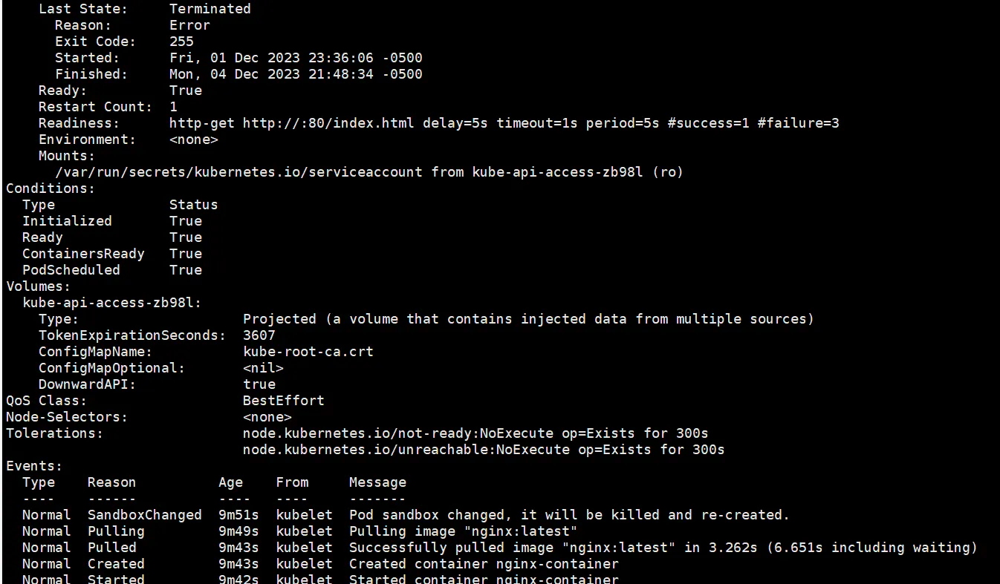

## 前言

我们在前面几篇博客中介绍了`Pod`生命周期各类组件与相关字段，比如`Phase`与`Condition`、`Probe`与`lifecycle`等等，这些组件的作用都是描述或调控`Pod`生命周期。这篇文章会向大家介绍`Pod`终止相关内容。

## Pod Termination

`Pod`是对`Container`的封装，`Container`里面运行的是服务，而**服务的本质是进程**，所以在`Pod`结束的时候，即不需要这些进程的时候，我们需要**优雅的停止进程**，比如允许服务进行一些连接的释放，文件的清理等等，而不是粗鲁的发送`KILL`信号。

`Pod Termination`的目的是能够主动请求终止进程，并且知道进程何时被终止，同时也要保证终止操作最终会完成。当你发送一个删除`Pod`的请求时，集群会记录优雅退出时间，在时间结束的时候`kubelet`会尝试优雅杀掉`Pod`。

### 具体实现

通常，带有优雅退出时间的`pod`将要停止时(不设置则默认为30S)，`kubelet`会向容器运行时组件发起带有超时时间的`SIGTERM`信号（正常终止信号，编号为15，允许进程执行清理工作，保存状态，关闭文件等等），请求去停止`Pod`中的那些容器，本质上是发送给容器中的主进程。这些请求会让容器异步停止，不能保证具体的停止顺序。

如下图，容器停止的顺序可以是先1后2，也可以是先2后1。




如果想要保证关闭的顺序，那么可以考虑使用`preStop`回调来实现或者**环境变量**来实现。

注意，这里容器会查看镜像有没有定义`STOPSIGNAL`值（`Dockerfile`中指定容器停止时发送的信号的指令），如果定义了，那么就会发送`STOPSIGNAL`而非`SIGTERM`。

一旦优雅退出时间过期而容器依旧没有停止，那么会向剩余的所有进程都发送`KILL`信号（编号9，强制性终止进程，不给与进程执行清理的机会。），并将`Pod`从`APIServer`中删掉。

之前有读者私聊我，为什么这里的`containers`字段下面的`name`和`ports`字段下面的`containerPort`前面都需要加上"-"，这里解答一下，yaml有一套自己的语法，因为`containers`和`ports`都是数组（一个`Pod`可以有多个容器，一个容器可以监听多个端口），每一个数组的列表项前面都需要加上"-"来标识。

### 实战

依旧是之前简单的`nginx-pod`，但是指明字段`terminationGracePeriodSeconds`为210，那么在收到退出信号之后的`210S`后，容器才会真正退出。

```
apiVersion: v1
kind: Pod
metadata:
  name: nginx-pod-demo
spec:
  containers:
  - name: nginx-container
    image: nginx:latest
    ports:
    - containerPort: 80
  terminationGracePeriodSeconds: 210
```

我们首先通过`kubectl describe pod nginx-pod-demo`查看当前Pod状态


能看到设置了`terminationGracePeriodSeconds`的`Pod`状态会变为`Terminating`，正在删除中，直到时间超时才会完全删掉。

### 源码

```
type PodSpec struct {
  ...
	// Optional duration in seconds the pod needs to terminate gracefully. May be decreased in delete request.
	// Value must be non-negative integer. The value zero indicates delete immediately.
	// If this value is nil, the default grace period will be used instead.
	// The grace period is the duration in seconds after the processes running in the pod are sent
	// a termination signal and the time when the processes are forcibly halted with a kill signal.
	// Set this value longer than the expected cleanup time for your process.
	// +optional
	TerminationGracePeriodSeconds *int64
  ...
}
```

不难看出`TerminationGracePeriodSeconds`的定义就是从**向Pod发起终止信号到进程被强制停止的时间段，** 这个值应该大于进程预期清理的时间 + 退出前处理的时间（`preStop`）。

让我们来看看这个值是怎么被使用的，笔者的源码版本是`v1.20`，源码文件`pkg/kubelet/pod_workers.go`

```
type PodStatusFunc func(pod *v1.Pod, podStatus *kubecontainer.PodStatus) v1.PodStatus

// KillPodOptions are options when performing a pod update whose update type is kill.
type KillPodOptions struct {
	// PodStatusFunc is the function to invoke to set pod status in response to a kill request.
	PodStatusFunc PodStatusFunc
	// PodTerminationGracePeriodSecondsOverride is optional override to use if a pod is being killed as part of kill operation.
	PodTerminationGracePeriodSecondsOverride *int64
}
```

首先优雅退出时间和`PodStatusFunc`（设置`PodStatus`的函数）组成了一个`KillPodOptions`字段，这个字段用来表示`Kill`操作的选项。

```
type syncPodOptions struct {
	// the mirror pod for the pod to sync, if it is a static pod
	mirrorPod *v1.Pod
	// pod to sync
	pod *v1.Pod
	// the type of update (create, update, sync)
	updateType kubetypes.SyncPodType
	// the current status
	podStatus *kubecontainer.PodStatus
	// if update type is kill, use the specified options to kill the pod.
	killPodOptions *KillPodOptions
}
```

`syncPodOptions`就是一次`kubelet`同步`Pod`的操作，`mirrorPod`只有在`static Pod`的时候才会用到（在`ApiServer`侧的静态`Pod`），通常我们不需要在意这个字段。

真正同步一次`Pod`操作只需要`pod`本身、pod当前状态，上述我们提到的`killPodOptions`和`SyncPodType`同步的方式，而`SyncPodType`就是一个`iota`常量，定义着是同步期望状态、更新、创建还是删除`Pod`。`KillPodOptions`只有在删除的时候才会有效。

```
const (
	// SyncPodSync is when the pod is synced to ensure desired state
	SyncPodSync SyncPodType = iota
	// SyncPodUpdate is when the pod is updated from source
	SyncPodUpdate
	// SyncPodCreate is when the pod is created from source
	SyncPodCreate
	// SyncPodKill is when the pod is killed based on a trigger internal to the kubelet for eviction.
	// If a SyncPodKill request is made to pod workers, the request is never dropped, and will always be processed.
	SyncPodKill
)
```

然后`syncPodOptions`这个结构体会被下面这个方法所使用，用来管理`kubelet`的`pod`池生命周期。

```
func (p *podWorkers) managePodLoop(podUpdates <-chan UpdatePodOptions) {
	var lastSyncTime time.Time
	for update := range podUpdates {
		err := func() error {
			podUID := update.Pod.UID
			// This is a blocking call that would return only if the cache
			// has an entry for the pod that is newer than minRuntimeCache
			// Time. This ensures the worker doesn't start syncing until
			// after the cache is at least newer than the finished time of
			// the previous sync.
			status, err := p.podCache.GetNewerThan(podUID, lastSyncTime)
			if err != nil {
				// This is the legacy event thrown by manage pod loop
				// all other events are now dispatched from syncPodFn
				p.recorder.Eventf(update.Pod, v1.EventTypeWarning, events.FailedSync, "error determining status: %v", err)
				return err
			}
			err = p.syncPodFn(syncPodOptions{
				mirrorPod:      update.MirrorPod,
				pod:            update.Pod,
				podStatus:      status,
				killPodOptions: update.KillPodOptions,
				updateType:     update.UpdateType,
			})
			lastSyncTime = time.Now()
			return err
		}()
		// notify the call-back function if the operation succeeded or not
		if update.OnCompleteFunc != nil {
			update.OnCompleteFunc(err)
		}
		if err != nil {
			// IMPORTANT: we do not log errors here, the syncPodFn is responsible for logging errors
			klog.Errorf("Error syncing pod %s (%q), skipping: %v", update.Pod.UID, format.Pod(update.Pod), err)
		}
		p.wrapUp(update.Pod.UID, err)
	}
}
```

1.  这个方法的接收者是`kubelet`，参数为一个更新`Pod`选项的通道。
1.  遍历这个通道，获取正在处理的`Pod`唯一标识符，通过这个标识符从`PodCache`中获取比`lastSyncTime`新的状态信息。
1.  进行一次`pod`状态的同步，参数就是我们上面提到的`syncPodOptions`
1.  后面就是一些收尾和打日志的工作

再看`kubelet`是如何更新`Pod`的

```
func (p *podWorkers) UpdatePod(options *UpdatePodOptions) {
	pod := options.Pod
	uid := pod.UID
	var podUpdates chan UpdatePodOptions
	var exists bool

	p.podLock.Lock()
	defer p.podLock.Unlock()
	if podUpdates, exists = p.podUpdates[uid]; !exists {
		// We need to have a buffer here, because checkForUpdates() method that
		// puts an update into channel is called from the same goroutine where
		// the channel is consumed. However, it is guaranteed that in such case
		// the channel is empty, so buffer of size 1 is enough.
		podUpdates = make(chan UpdatePodOptions, 1)
		p.podUpdates[uid] = podUpdates

		// Creating a new pod worker either means this is a new pod, or that the
		// kubelet just restarted. In either case the kubelet is willing to believe
		// the status of the pod for the first pod worker sync. See corresponding
		// comment in syncPod.
		go func() {
			defer runtime.HandleCrash()
			p.managePodLoop(podUpdates)
		}()
	}
	if !p.isWorking[pod.UID] {
		p.isWorking[pod.UID] = true
		podUpdates <- *options
	} else {
		// if a request to kill a pod is pending, we do not let anything overwrite that request.
		update, found := p.lastUndeliveredWorkUpdate[pod.UID]
		if !found || update.UpdateType != kubetypes.SyncPodKill {
			p.lastUndeliveredWorkUpdate[pod.UID] = *options
		}
	}
}
```

能看到除了加锁和一些其他收尾事件（比如发信号，修改状态等等），`UpdatePod`并没有多余的额外逻辑处理，最本质的还是进行`managePodLoop`管理`pod`的生命周期。

## 结语

这篇博客主要介绍了`Pod Termination`相关概念，带领大家由浅入深了解`Pod Termination`的实现和具体使用以及`kubelet操控Pod`相关代码。

《每天十分钟，轻松入门K8S》的第八篇**09.源码级别Pod详解（五）： Pod readiness与Container Probe**到这里就结束了，之后的几讲都会和`Pod`相关，深入源码级别探索K8S核心概念`Pod`相关内容，感兴趣的朋友欢迎**点赞、评论、收藏、订阅，您的支持就是我最大的动力。**

****

**推荐阅读**：

<https://juejin.cn/post/7307542269674651682>

<https://juejin.cn/post/7296303730772656162>

<https://juejin.cn/post/7295565904406511657>

<https://juejin.cn/post/7292323577210404915>
